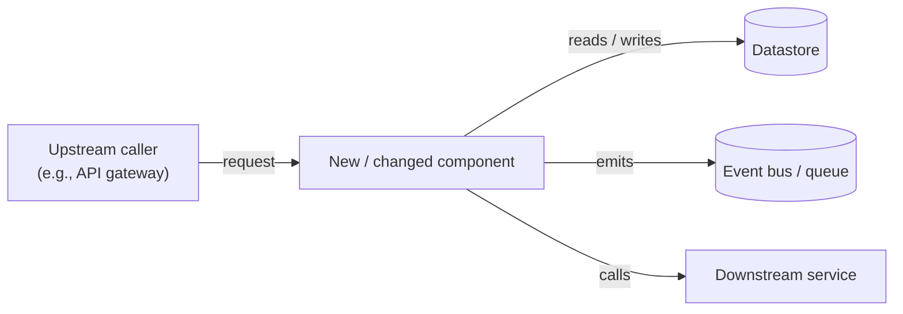

# Implementation Plan: [FEATURE]

**Branch**: `[###-feature-name]` | **Date**: [DATE] | **Spec**: [link]
**Input**: Feature specification from `/specs/[###-feature-name]/spec.md`

**Note**: This template is filled in by the `/speckit.plan` command. See `.specify/templates/plan-template.md` for the execution workflow.

## Summary

[Extract from feature spec: primary requirement + technical approach from research]

## Technical Context

<!--
  ACTION REQUIRED: Replace the content in this section with the technical details
  for the project. The structure here is presented in advisory capacity to guide
  the iteration process.
-->

**Language/Version**: [e.g., Python 3.11, Swift 5.9, Rust 1.75 or NEEDS CLARIFICATION]
**Primary Dependencies**: [e.g., FastAPI, UIKit, LLVM or NEEDS CLARIFICATION]
**Storage**: [if applicable, e.g., PostgreSQL, CoreData, files or N/A]
**Testing**: [e.g., pytest, XCTest, cargo test or NEEDS CLARIFICATION]
**Target Platform**: [e.g., Linux server, iOS 15+, WASM or NEEDS CLARIFICATION]
**Project Type**: [e.g., library/cli/web-service/mobile-app/compiler/desktop-app or NEEDS CLARIFICATION]
**Performance Goals**: [domain-specific, e.g., 1000 req/s, 10k lines/sec, 60 fps or NEEDS CLARIFICATION]
**Constraints**: [domain-specific, e.g., <200ms p95, <100MB memory, offline-capable or NEEDS CLARIFICATION]
**Scale/Scope**: [domain-specific, e.g., 10k users, 1M LOC, 50 screens or NEEDS CLARIFICATION]

## Cross-Repo Context

<!--
  CONDITIONAL: This section exists ONLY when the feature has a dependency
  manifest at specs/[###-feature]/dependency-manifest.md (delivered with
  multi-codebase epic handoffs from pm-spec; /speckit.specify Adopt mode
  copies it there). If there is no manifest, DELETE this section entirely
  and fill the "Cross-repo contract surface" Architecture Review row with:
  N/A — no dependency manifest (single-codebase feature).

  When the manifest exists, fill this section from it and point the
  "Cross-repo contract surface" Architecture Review row here.

  Fill rules (trust rules — non-negotiable):
  - Cite existing contracts ONLY as the manifest (or a fresher deep scan)
    states them, each with its evidence URL, confidence tier, and
    scanned_at date. Never paraphrase a contract into existence; never
    upgrade a confidence tier.
  - medium/low-confidence claims are rendered as "possible, unconfirmed",
    never as fact. Unknown is stated as unknown — do not fill graph gaps
    from imagination.
  - New/changed boundary needs stay in business terms here; the design
    that satisfies them belongs in this plan's main sections (and its
    interface contracts in contracts/).
-->

**Manifest**: [dependency-manifest.md](dependency-manifest.md) — Epic [###]: [Epic Name]
**Freshness**: [re-verified against the graph on YYYY-MM-DD | static — Impact MCP connector unavailable; contracts cited as of their scanned_at dates]

### Sibling codebases

| Codebase | System(s) | Owning team | Slack | Link confidence |
|---|---|---|---|---|
| [repo_id] | [system name] | [owner_team] | [#channel] | [confirmed/high] |

### This repo's slot in the coordination order

[N of M] — [why, from the manifest's suggested order: name the upstream
codebases whose contract changes this plan depends on, and the downstream
codebases consuming this repo's changes. "1 of M" = nothing upstream.]

### Boundary contracts touching this repo

<!-- One entry per Boundary-dependencies subsection in the manifest that
     involves THIS codebase. Omit boundaries between two sibling repos. -->

- **[consumer-slug] → [producer-slug]** — FR-[NNN] ([consumer]) depends on
  FR-[NNN] ([producer]) [or "no producer-side FR; existing capability"].
  - Existing contract (fact): [verbatim contract line from the manifest] —
    evidence: [URL]; confidence: [tier]; scanned: [date]
    [; **STALE** — repo HEAD moved since the scan, re-scan offered]
    [; re-scan running — forced re-scan in flight; contract cited as of
    its scanned date until it lands]
    [or: no deep scan available — engineering confirms the contract during
    planning]
  - Change needed: [none — existing contract suffices | business-terms
    statement from the manifest]

### Confidence & gaps carried from the manifest

[Copy the manifest's "Confidence & gaps" items verbatim, or "none carried".]

## Constitution Check

*GATE: Must pass before Phase 0 research. Re-check after Phase 1 design.*

[Gates determined based on constitution file]

## Architecture Review

*GATE: Every row MUST have either a concrete **Decision** (1–2 sentences,
pointing at where in this plan the dimension is addressed) or
`N/A — <reason>` (one sentence explaining why the dimension does not
apply to this feature). An empty cell or a bare `N/A` is a blocker —
`/speckit.analyze` will fail the build until each row is filled.*

The point is to **force consideration**, not to fill boxes. If a
dimension applies, point to the section/file where it is addressed
rather than restating the design here.

| Category | Dimension | Decision or N/A reason |
|---|---|---|
| Cross-cutting | Authentication / authorization | |
| Cross-cutting | Input validation & sanitization | |
| Cross-cutting | Error handling strategy | |
| Cross-cutting | Logging & observability (metrics, tracing, structured logs) | |
| Cross-cutting | Secrets / config management | |
| Cross-cutting | Idempotency (for state-changing ops) | |
| Cross-cutting | Retries, timeouts, circuit breakers | |
| Cross-cutting | Backwards compatibility / API versioning | |
| Failure modes | Partial-failure behavior | |
| Failure modes | Downstream outage handling | |
| Failure modes | Concurrent writes / race conditions | |
| Failure modes | Replay / duplicate request handling | |
| Integration | Integration boundaries (callers + dependencies) | |
| Integration | Contract evolution strategy | |
| Integration | Cross-repo contract surface (dependency manifest) | |
| Data | PII / sensitive-data classification | |
| Data | Tenant isolation (if multi-tenant) | |
| Data | Data lifecycle (retention, deletion) | |
| Data | Money / decimal handling (if financial) | |
| Operational | Deployment & rollback strategy | |
| Operational | Schema / data migration plan | |
| Alternatives | Alternatives considered + rejection rationale | |

**Drift signal**: `/speckit.feedback`'s architecture-drift heuristics
(`new_top_level_dirs_since_plan`, `new_runtime_dependencies`,
`files_outside_planned_paths`) compare HEAD against this plan at
story-complete and end-of-feature. Non-zero values are a prompt to
revisit this table — either the implementation drifted, or the table
was incomplete.

## Architecture Diagram

*MANDATORY. A picture of the components introduced or changed by this
feature and how they fit together. Use **Mermaid** — it renders in
GitHub, GitLab, VS Code, IntelliJ, and most modern IDEs. Prefer Mermaid
over ASCII art, screenshots, or external image links.*

**At minimum**, include a **component / system-context diagram**
showing this feature's components, their callers, and their direct
dependencies. Add other diagrams only when they earn their keep:

| Diagram type | Add when |
|---|---|
| Component / context | **Always** (the minimum) |
| Sequence | Non-trivial interaction across 3+ components, or async flows |
| State | The feature has a finite state machine (orders, jobs, sessions) |
| Data flow | Pipeline / ETL features where data shape changes between stages |
| Deployment | The deployment surface changes (new service, new region, new tier) |
| ER (data) | Schema is non-trivial; covers what `data-model.md` shows in prose |

Replace the placeholder below with the actual diagram(s) for this
feature. The diagram MUST stay in sync with reality — the
End-of-Feature step in the tasks template includes a verification
task. If a diagram type is genuinely not applicable, omit that
sub-section (don't include an empty placeholder); the component
diagram itself is non-negotiable.

### Component diagram



> Replace the placeholder above. Label every edge with what flows
> across it (request, event name, table name) — unlabeled arrows
> are a frequent review finding.

<!-- Add additional diagrams (Sequence, State, etc.) below ONLY if
     the table above flagged them as needed. Each gets its own
     `### <Type> diagram` heading and a Mermaid block. -->

## Project Structure

### Documentation (this feature)

```text
specs/[###-feature]/
├── plan.md              # Engineering plan (this file)
├── research.md          # Phase 0 output (/speckit.plan command)
├── data-model.md        # Phase 1 output (/speckit.plan command)
├── quickstart.md        # Phase 1 output (/speckit.plan command)
├── contracts/           # Phase 1 output (/speckit.plan command)
└── tasks.md             # Tasks from plan.md (/speckit.tasks)
```

### Source Code (repository root)
<!--
  ACTION REQUIRED: Replace the placeholder tree below with the concrete layout
  for this feature. Delete unused options and expand the chosen structure with
  real paths (e.g., apps/admin, packages/something). The delivered plan must
  not include Option labels.
-->

```text
# [REMOVE IF UNUSED] Option 1: Single project (DEFAULT)
src/
├── models/
├── services/
├── cli/
└── lib/

tests/
├── contract/
├── integration/
└── unit/

# [REMOVE IF UNUSED] Option 2: Web application (when "frontend" + "backend" detected)
backend/
├── src/
│   ├── models/
│   ├── services/
│   └── api/
└── tests/

frontend/
├── src/
│   ├── components/
│   ├── pages/
│   └── services/
└── tests/

# [REMOVE IF UNUSED] Option 3: Mobile + API (when "iOS/Android" detected)
api/
└── [same as backend above]

ios/ or android/
└── [platform-specific structure: feature modules, UI flows, platform tests]
```

**Structure Decision**: [Document the selected structure and reference the real
directories captured above]

## Test Strategy

<!--
  ACTION REQUIRED: If the spec defines coverage targets (NFRs, success criteria)
  or the constitution requires automated tests, this section is MANDATORY.
  Otherwise, delete this section entirely.

  The test files listed here will be used by /speckit.tasks to generate
  test-creation tasks. Every test file listed MUST become a task.
-->

**Coverage Target**: [e.g., >=95% line and branch, or N/A if spec has no coverage NFR]
**Test Framework**: [from Technical Context above]
**Test Types**: [unit, integration, contract — based on what the spec requires]

| Test File | Type | Covers |
| --- | --- | --- |
| [tests/unit/test_service.py] | Unit | [JobService logic, edge cases] |
| [tests/integration/test_endpoint.py] | Integration | [Acceptance scenario 1, 2] |

## Complexity Tracking

> **Fill ONLY if Constitution Check has violations that must be justified**

| Violation | Why Needed | Simpler Alternative Rejected Because |
|-----------|------------|-------------------------------------|
| [e.g., 4th project] | [current need] | [why 3 projects insufficient] |
| [e.g., Repository pattern] | [specific problem] | [why direct DB access insufficient] |
