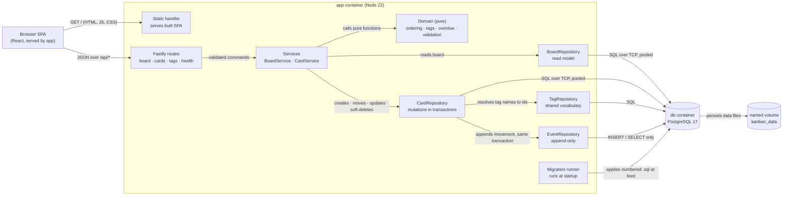
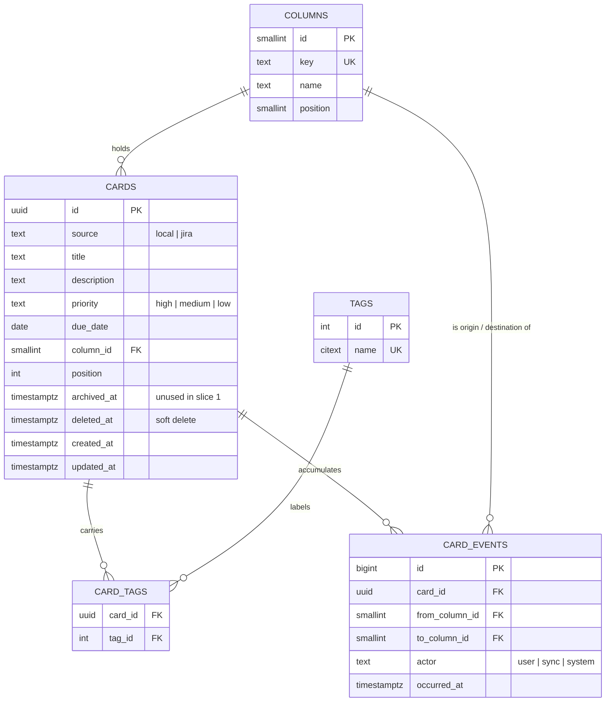

# Implementation Plan: Board Foundation

**Branch**: `001-board-foundation` | **Date**: 2026-08-26 | **Spec**: [spec.md](spec.md)

**Input**: Feature specification from `/specs/001-board-foundation/spec.md`

**Verification**: [spec-verification.md](spec-verification.md) — Result: PASS

## Summary

Build a single-user Kanban board with six fixed columns, locally created
cards, drag and keyboard movement, an append-only movement history, and a
two-container deployment whose data survives container recreation.

The technical approach is deliberately small: one Fastify process serving both
the JSON API and the built React bundle, raw SQL against PostgreSQL with a
hand-rolled migration runner, and no state-management or CSS framework. The
only non-obvious decision is that card ordering renumbers the affected column
inside the move transaction rather than using fractional positions — with
columns holding tens of cards, renumbering is both simpler and immune to the
precision drift that fractional ordering accumulates.

## Technical Context

**Language/Version**: TypeScript 5.7 on Node 22 LTS

**Primary Dependencies**: Fastify 5 (HTTP), `pg` 8 (PostgreSQL client, raw
SQL — no ORM), Zod 3 (input validation), React 19 + Vite 6 (front end),
`@dnd-kit/core` + `@dnd-kit/sortable` (drag with a first-class keyboard
sensor)

**Storage**: PostgreSQL 17, one database, six tables, schema applied by a
numbered-SQL migration runner at process start

**Testing**: Vitest (unit), `@cucumber/cucumber` (Gherkin acceptance suite
against the running API and a real database), Playwright (drag-and-drop,
keyboard, no-reload verification)

**Target Platform**: Linux containers via Docker Compose on the user's
machine; browser target is current Chrome

**Project Type**: Web application — single process serving an API and a
static SPA

**Performance Goals**: Board load under 1s with 50 cards (SC-002); move
rendered within 100ms before server confirmation (SC-003)

**Constraints**: Bound to `127.0.0.1` only; no authentication; no credential
of any kind in this slice; data must survive container recreation

**Scale/Scope**: One user, one machine, tens of cards, roughly 12 API
endpoints and 8 UI components

## Constitution Check

*GATE: run before Phase 0 research; re-checked after Phase 1 design.*

| # | Principle | Verdict | How this plan satisfies it |
|---|---|---|---|
| I | Secure | PASS | No credential of any kind exists in this slice — Jira arrives in Slice 2. The database password is supplied by env and lives in a gitignored `.env`. Every request body is validated by a Zod schema at the route boundary before use. Binding to `127.0.0.1` is what makes the no-authentication decision defensible (FR-034). Dependency CVE scan runs before merge. |
| II | Composable | PASS | Three layers with narrow interfaces: routes (HTTP shape), services (behavior), repositories (SQL). Pure domain functions — ordering, tag normalization, overdue — are separate from all I/O. |
| III | Available | PASS (scoped) | Single-user local tool; availability is "the container is up". Healthcheck reports readiness including database reachability (FR-032). |
| IV | Resilient | PASS | A failed move reverts the optimistic UI and reports a typed reason (FR-020). An unreachable database at start fails loudly rather than serving a board that discards writes (FR-037). |
| V | Manageable | **DEVIATION** | Constitution requires runbooks published to Confluence. This is a personal single-user tool with no on-call; `README.md` carries start, stop, reset and the volume name (FR-038). Recorded in Complexity Tracking. |
| VI | Monitored | **DEVIATION** | Structured JSON logs to stdout only. No metrics or tracing backend — there is no operator but the user, and no aggregation to send them to. Recorded in Complexity Tracking. |
| VII | Deployable | PASS | `docker compose up` brings the whole system to healthy (FR-033). Rollback is redeploying the previous image; the volume is untouched by either. |
| VIII | Compliant | PASS (exempt) | Holds no PII and no account-critical data — card titles the user wrote about their own work. The conditional audit-logging rule does not engage. The movement history exists for the user's benefit, not for audit. |
| IX | Reproducible | PASS | `package-lock.json` committed, base images pinned by digest, all dependencies from the public npm registry. |
| X | Testable | PASS | Services receive their repositories through constructor injection. Ordering, validation, tag normalization and overdue are pure functions, unit-tested without a database. See Test Strategy. |
| XI | Documented | PASS | `README.md` and `docs/external-interactions.md` (PostgreSQL is this slice's only external touchpoint) are written in the same change as the code. |
| XII | Simplicity First | PASS | Raw SQL over an ORM; a 40-line migration runner over a migration framework; column renumbering over fractional ordering; React context over a state library; CSS custom properties over a CSS framework. One speculative abstraction was explicitly rejected — see Alternatives. |
| XIII | Lean Footprint | PASS | Six runtime dependencies, each justified in Phase 0 research. No utility or shared module is created. |
| XIV | Maintainability | PASS | Class-level decoupling only; no new packages, no `utils/` module. Names come from the spec's vocabulary — Column, Card, Tag, CardMovement — so the code reads like the specification. |

**Post-Phase-1 re-check**: no verdict changed. The data model added two
unused columns, which is the one Simplicity First tension in this plan and is
recorded in Complexity Tracking rather than waved through.

## Project Structure

### Documentation (this feature)

```text
specs/001-board-foundation/
├── plan.md                 # This file
├── spec.md                 # Feature specification
├── spec-verification.md    # Verification gate result — PASS
├── research.md             # Phase 0: dependency and approach decisions
├── data-model.md           # Phase 1: schema and invariants
├── quickstart.md           # Phase 1: how to run and verify it
├── contracts/
│   └── api.md              # Phase 1: HTTP contract
└── tasks.md                # Phase 2 — created by /speckit.tasks, not here
```

### Source Code (repository root)

```text
src/
├── server/
│   ├── index.ts             # Process entry: migrate, then listen on loopback
│   ├── app.ts               # Fastify instance, plugin and route registration
│   ├── routes/
│   │   ├── board.ts         # GET /api/board
│   │   ├── cards.ts         # create, update, soft-delete, move, events
│   │   ├── tags.ts          # tag vocabulary lookup
│   │   └── health.ts        # GET /api/health
│   ├── services/
│   │   ├── board-service.ts
│   │   ├── card-service.ts
│   │   └── movement-service.ts
│   ├── repositories/
│   │   ├── card-repository.ts
│   │   ├── tag-repository.ts
│   │   └── event-repository.ts
│   ├── db/
│   │   ├── pool.ts
│   │   ├── migrate.ts       # numbered-SQL runner
│   │   └── migrations/
│   │       ├── 001_columns.sql
│   │       ├── 002_cards.sql
│   │       ├── 003_tags.sql
│   │       └── 004_card_events.sql
│   └── errors.ts            # typed failures -> HTTP problem responses
├── domain/                  # Pure, no I/O, no clock injection at call sites
│   ├── ordering.ts          # position renumbering within a column
│   ├── tags.ts              # trim, case-fold, deduplicate
│   ├── overdue.ts           # due-date comparison against a supplied today
│   └── validation.ts        # Zod schemas shared by server and web
├── shared/
│   └── types.ts             # Card, Column, Priority, CardSource, Actor
└── web/
    ├── main.tsx
    ├── App.tsx
    ├── board/
    │   ├── Board.tsx        # six columns, drag context
    │   ├── ColumnView.tsx
    │   ├── CardView.tsx     # dense card face
    │   └── use-board.ts     # optimistic move, revert on failure
    ├── cards/
    │   ├── CardDialog.tsx   # create and edit
    │   └── TagInput.tsx     # vocabulary autocomplete
    ├── keyboard/
    │   ├── use-shortcuts.ts
    │   └── HelpOverlay.tsx
    └── styles/
        └── tokens.css       # dark palette as custom properties

tests/
├── unit/                    # Vitest, no database
├── features/                # Gherkin + step definitions (cucumber-js)
│   ├── *.feature
│   └── steps/
└── e2e/                     # Playwright

docker/
└── Dockerfile               # multi-stage: build web + server, run server
docker-compose.yml
README.md
docs/external-interactions.md
```

**Structure Decision**: One npm package, not a workspace monorepo. Server and
web share `src/domain` and `src/shared` by direct import, which Vite and
`tsc` both resolve without workspace plumbing. Splitting into packages would
buy nothing here — there is one deployable and one consumer of each module —
and Principle XIV explicitly warns against reaching for a package boundary
before a second genuine consumer exists.

## Complexity Tracking

| Violation | Why Needed | Simpler Alternative Rejected Because |
|---|---|---|
| `cards.archived_at` and `cards.deleted_at` ship unused (Principle XII: do not anticipate future requirements) | `deleted_at` is genuinely used — FR-041 makes deletion soft, so it is load-bearing in this slice. `archived_at` is the real violation: nothing in Slice 1 writes or reads it. It exists so Slice 4 adds the archive without migrating a database that by then holds the user's only copy of their ad-hoc cards. | Adding it in Slice 4 means a migration against live personal data, and rewriting the Done-column semantics after cards already sit there. The cost of carrying it now is one nullable timestamp column and one line of the spec's assumptions. |
| `cards.source` ships with only one possible value (`local`) | FR-010, FR-011 and FR-015 all reference it in this slice: the board marks source visually, and deletion is refused for non-local cards — a rule that is testable now (BH-023) by seeding a non-local row. | Not a speculative column: three requirements and one behavior pathway depend on it before Slice 2 exists. |
| Principle V — runbooks are not published to Confluence | No on-call rotation, no operator other than the sole user, no production incident path. `README.md` carries start, stop, reset and the name of the volume whose deletion loses data (FR-038, risk R-7). | Publishing a Confluence runbook for a localhost tool one person runs would be documentation nobody reads, which Principle XI warns is worse than none. |
| `card-repository.ts` is 302 lines, against a 300-line hygiene limit | It holds four card mutations (create, move, update, soft-delete) plus the row lock they share. Cohesive: every method mutates a card inside a transaction. The length is raw SQL and the comments explaining why each transaction locks what it locks. The board read model *was* split out of it during polish — that was a genuine seam and took it from 379 lines — but there is no second seam left. | Shaving two lines by deleting comments would trade an explanation of why the move transaction takes row locks for a number. Splitting four mutations across two classes to satisfy a threshold would create a class with no independent reason to exist, which Principle XIV forbids more strongly than the line count asks. |
| Principle VI — no metrics or tracing backend | Structured JSON logs to stdout, read with `docker compose logs`. There is no aggregation tier to ship telemetry to and no second observer. | Standing up a metrics stack beside a two-container personal tool inverts the footprint of the thing being observed. |

## Architecture Review

| Category | Dimension | Decision or N/A reason |
|---|---|---|
| Cross-cutting | Authentication / authorization | N/A — no authentication by design (FR-035). Loopback binding (FR-034) is the control; recorded as decision D-11 in the BRD and revisited if the binding ever changes. |
| Cross-cutting | Input validation & sanitization | Zod schemas in `src/domain/validation.ts` validate every request body at the route boundary before use; the same schemas drive front-end form validation, so the two cannot disagree. |
| Cross-cutting | Error handling strategy | Typed domain errors in `src/server/errors.ts` map to `application/problem+json` with a stable `code`. The web client switches on `code`, never on message text — see contracts/api.md. |
| Cross-cutting | Logging & observability | Structured JSON to stdout via Fastify's logger; request id on every line. No metrics or tracing backend — deviation recorded in Complexity Tracking. |
| Cross-cutting | Secrets / config management | Only `POSTGRES_PASSWORD` and `DATABASE_URL` exist in this slice, supplied by env from a gitignored `.env`; `.env.example` is committed with placeholder values. No secret reaches the browser. |
| Cross-cutting | Idempotency | Move is idempotent by construction: it sets an absolute target (column + index) rather than applying a delta, so a repeated request lands the card in the same place. A move to the position a card already occupies writes nothing and appends no history (spec edge case). |
| Cross-cutting | Retries, timeouts, circuit breakers | Database statement timeout of 5s and a bounded connection pool. No retries on writes — the optimistic UI reverts and lets the user decide, which is more honest than a silent retry. No downstream service exists in this slice. |
| Cross-cutting | Backwards compatibility / API versioning | N/A — the API has exactly one client, shipped in the same image from the same commit. Versioning would be ceremony with no second consumer. |
| Failure modes | Partial-failure behavior | Every mutation runs in one transaction, including the movement-history append, so a card never moves without its history record and never records a move that did not happen (FR-026, FR-020). |
| Failure modes | Downstream outage handling | The database is the only downstream. Unreachable at start: fail loudly and refuse to serve (FR-037). Unreachable later: health reports unhealthy (FR-032) and mutations return a typed error the UI reverts against. |
| Failure modes | Concurrent writes / race conditions | Moves take a row-level lock on the affected card and `SELECT ... FOR UPDATE` on the target column's cards before renumbering, so two rapid moves serialize and the later one wins with both recorded in order (spec edge case). Two-tab reconciliation is explicitly out of scope. |
| Failure modes | Replay / duplicate request handling | Covered by idempotency above — a replayed move is a no-op rather than a second history record. |
| Integration | Integration boundaries | One inbound (browser to API, same origin, same image) and one outbound (API to PostgreSQL). Registered in `docs/external-interactions.md`. |
| Integration | Contract evolution strategy | `contracts/api.md` is the contract; the Gherkin suite exercises it. Slice 2 extends it additively — new fields on Card, new endpoints — with no breaking change to what this slice defines. |
| Integration | Cross-repo contract surface (dependency manifest) | N/A — no dependency manifest (single-codebase feature). |
| Data | PII / sensitive-data classification | None. Card titles and descriptions are the user's notes about their own work. No names, no identifiers, no account data. Principle VIII's conditional audit rule does not engage. |
| Data | Tenant isolation | N/A — single user, single database, no tenancy concept. |
| Data | Data lifecycle | Cards are soft-deleted and retained (FR-041); movement history is append-only and never pruned (FR-027, FR-029). No retention policy — the data is small and the user owns it. Slice 4 adds archival, which moves cards off the board without deleting them. |
| Data | Money / decimal handling | N/A — no financial data. |
| Operational | Deployment & rollback strategy | `docker compose up -d` deploys; rollback is redeploying the previous image tag. The named volume is independent of both, so neither touches data. |
| Operational | Schema / data migration plan | Numbered `.sql` files applied in order at process start inside a transaction, tracked in a `schema_migrations` table. Forward-only — with one user and one database, a down-migration path is speculative machinery (Principle XII). |
| Alternatives | Alternatives considered + rejection rationale | See research.md. The significant rejection: **a `JiraPort` interface in this slice**. It would have exactly one implementation — a null one — no caller, and no test that needs it, which is precisely the speculative abstraction Principle XII forbids and Principle XIV's Definition of Done fails on. The seam Slice 2 actually needs is the `source` column and the movement-history `actor` field, both of which this slice uses for real. Also rejected: an ORM, a migration framework, fractional ordering, a state-management library, and a CSS framework. |

## Architecture Diagram

### Component diagram



### Entity relationship diagram



### Sequence diagram — optimistic move and revert

*Included because the move path spans four components and its failure branch
is the single most likely place for the board to end up confidently wrong.
Updated after implementation: the history append is a separate branch, because
a reorder within one column deliberately writes no record (FR-028).*

```mermaid
sequenceDiagram
  actor User
  participant UI as Board (React)
  participant API as POST /api/cards/:id/move
  participant SVC as Card service
  participant DB as PostgreSQL

  User->>UI: drag card to Test, release
  UI->>UI: apply move locally (renders < 100ms)
  UI->>API: { toColumnId, toIndex }
  API->>SVC: validated move command
  SVC->>DB: BEGIN; lock card + target column rows
  alt target position unchanged
    SVC->>DB: ROLLBACK (no write, no history)
    SVC-->>UI: 200 { card, moved: false }
  else move applies within one column
    SVC->>DB: renumber column, update card
    SVC->>DB: COMMIT
    SVC-->>UI: 200 { card, moved: true }
  else move changes column
    SVC->>DB: renumber both columns, update card
    SVC->>DB: INSERT card_event (from, to, actor=user)
    SVC->>DB: COMMIT
    SVC-->>UI: 200 { card, moved: true }
  end
  alt database unavailable
    DB--xSVC: connection error
    SVC-->>API: DatabaseUnavailable
    API-->>UI: 503 problem+json { code }
    UI->>UI: revert card to prior column and index
    UI->>User: toast naming the reason
  end
```

## Test Strategy

**Coverage Target**: Every one of the spec's 30 behavior pathways
(BH-001…BH-030) is covered by the verification row that pins it
(TEST-001…TEST-030). No line-coverage percentage is set — the spec defines
coverage by behavior, and a percentage target would reward testing the easy
half of the code.

**Test Framework**: Vitest (unit), `@cucumber/cucumber` (acceptance),
Playwright (browser)

**Test Types**: unit, acceptance (API-level Gherkin against a real database),
end-to-end (browser), operational (container lifecycle)

**Order**: Gherkin scenarios are authored and failing before the
implementation of the behavior they pin — this is the project's stated
BDD/TDD requirement (NFR-21), not a preference.

| Test File | Type | Covers |
| --- | --- | --- |
| `tests/unit/ordering.test.ts` | Unit | Column renumbering: insert at top, middle, end; move to occupied position; single-card column |
| `tests/unit/tags.test.ts` | Unit | Trim, case-fold, deduplicate within a card; vocabulary reuse — BH-005, BH-030 |
| `tests/unit/overdue.test.ts` | Unit | Due today is not overdue; due yesterday is; no due date — BH-029 |
| `tests/unit/validation.test.ts` | Unit | Blank and whitespace titles rejected; priority defaulting; long titles — BH-003, BH-004 |
| `tests/features/board-structure.feature` | Acceptance | BH-001 |
| `tests/features/card-creation.feature` | Acceptance | BH-002, BH-003, BH-004, BH-005, BH-006 |
| `tests/features/card-movement.feature` | Acceptance | BH-007, BH-008, BH-011 |
| `tests/features/card-editing.feature` | Acceptance | BH-012, BH-013, BH-023 |
| `tests/features/movement-history.feature` | Acceptance | BH-016, BH-017, BH-018 |
| `tests/features/due-dates.feature` | Acceptance | BH-029 |
| `tests/features/tags.feature` | Acceptance | BH-030 |
| `tests/features/health.feature` | Acceptance | BH-021 |
| `tests/features/steps/*.ts` | Acceptance | Step definitions driving the HTTP API |
| `tests/e2e/drag-and-drop.spec.ts` | E2E | BH-007, BH-008, BH-009, BH-010, BH-011 |
| `tests/e2e/keyboard.spec.ts` | E2E | BH-014, BH-015, BH-027 |
| `tests/e2e/card-face.spec.ts` | E2E | BH-006, BH-028 |
| `tests/e2e/no-reload.spec.ts` | E2E | BH-025 |
| `tests/e2e/optimistic-revert.spec.ts` | E2E | BH-009, BH-010 |
| `tests/ops/persistence.test.ts` | Operational | BH-019, BH-020 — destroy and recreate containers, assert board intact |
| `tests/ops/startup.test.ts` | Operational | BH-020, BH-021, BH-024 — first-start migration, health, single-command bring-up |
| `tests/ops/loopback.test.ts` | Operational | BH-022 — serves on loopback, refuses non-loopback |
| `tests/ops/docs.test.ts` | Operational | BH-026 — README covers start, stop, reset and names the volume |

**TestRail sync point**: `spec.md` carries a `## Behavior Pathways` section,
so during `/speckit.implement` the first task in each user story's phase that
has a `BH-###`/`TEST-###` pair authors or syncs that case to TestRail via
`spec-testrail-sync` **before** any implementation task in that same story
runs. Practically: the story's Gherkin file and its TestRail case are created
together, ahead of the code they describe.

## TradeStation SDD — Required plan close-outs

- **Test Strategy is mandatory** — every test file named above becomes a task
  in `/speckit.tasks`. There are 22.
- **Constitution Check** ran before Phase 0 and again after Phase 1 design;
  no verdict changed, and the four deviations are recorded in Complexity
  Tracking rather than left implicit.
