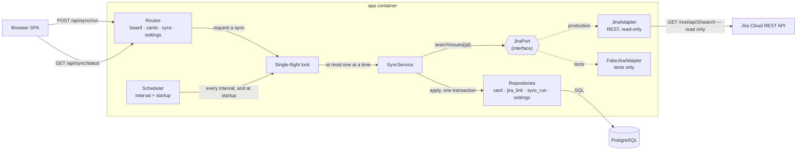
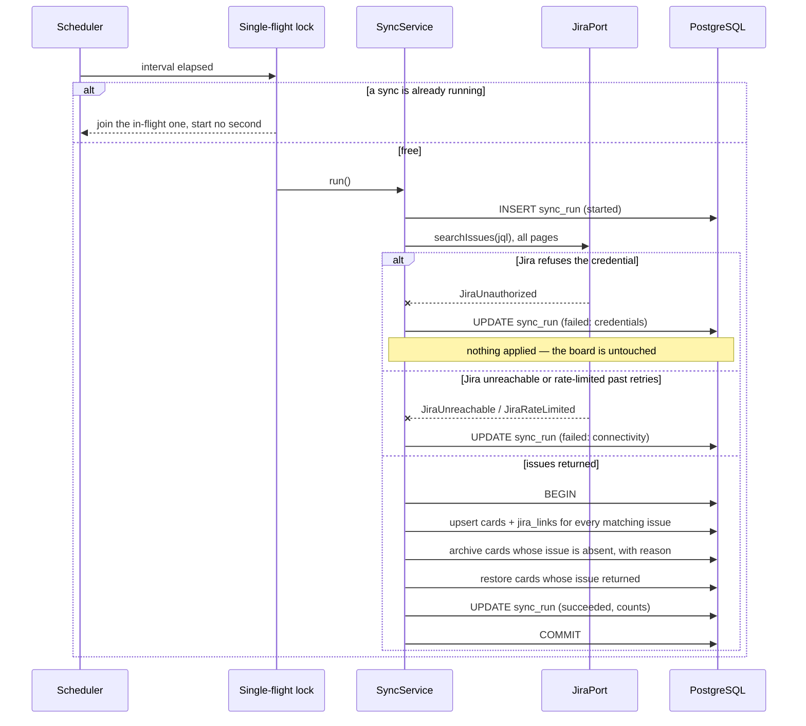
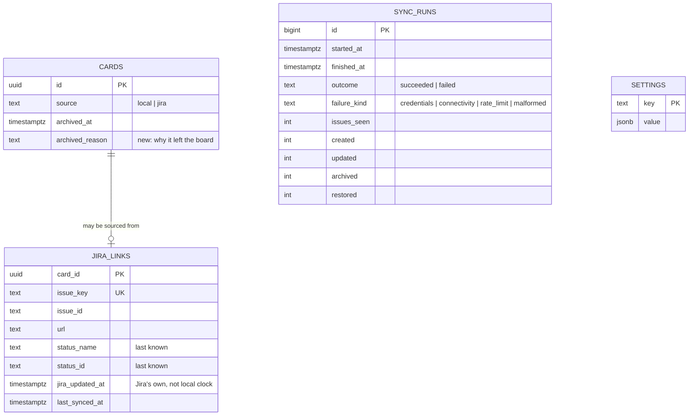

# Implementation Plan: Jira Import

**Branch**: `002-jira-import` | **Date**: 2026-08-26 | **Spec**: [spec.md](spec.md)

**Input**: Feature specification from `/specs/002-jira-import/spec.md`

**Verification**: [spec-verification.md](spec-verification.md) — Result: PASS
**Risk Tier**: FULL

## Summary

Import the user's assigned Jira issues onto the board built in slice 1, read
only, on a poll and on demand. Cards appear in Backlog and stay where the user
puts them; the sync records what Jira said and acts on none of it.

Two decisions shape everything else. **The whole apply phase runs in one
transaction** — issues are fetched first, then applied atomically — which is
how FR-131's "a failed sync leaves no partially applied changes" is satisfied
by construction rather than by careful cleanup. And **`JiraPort` is introduced
now, not in slice 1**, because it finally has what an interface needs: a real
implementation, a fake, and a caller. The same abstraction was proposed and
rejected during slice 1 planning for having none of those.

The riskiest part of this slice is not the sync logic — it is the credential.
Everything about how it is read, passed and logged is treated as a
first-class requirement rather than a configuration detail.

**Amended 2026-08-26**, after the first real import. Cards are placed in the
column their Jira status maps to rather than all landing in Backlog. The
original rule was a clean code seam that produced an unusable board: eight of
eleven real issues arrived in the wrong column, and every new assignment would
have needed re-sorting by hand. Ongoing movement remains slice 3's; only
initial placement changed.

## Technical Context

**Language/Version**: TypeScript 5.7 on Node 22 LTS (unchanged from slice 1)

**Primary Dependencies**: no new runtime dependency. Jira is reached with the
platform `fetch`; `undici`'s `MockAgent` (already present transitively, added
as an explicit dev dependency) records and replays fixtures for contract tests.

**Storage**: PostgreSQL 17. Three new tables — `jira_links`, `sync_runs`,
`settings` — and one new column on `cards`.

**Testing**: Vitest (unit + contract), `@cucumber/cucumber` (acceptance against
a `FakeJiraAdapter`), Playwright (sync status and Jira card face)

**Target Platform**: unchanged — two containers, loopback only

**Project Type**: web application (unchanged)

**Performance Goals**: a sync of the user's assigned issues (tens, per BRD
assumption A-4) completes in a few seconds. No incremental sync.

**Constraints**: no write of any kind reaches Jira; no credential reaches the
browser or any log; a failed sync never blocks the board

**Scale/Scope**: tens of issues, one Jira site, one query

## Constitution Check

*GATE: run before Phase 0 research; re-checked after Phase 1 design.*

| # | Principle | Verdict | How this plan satisfies it |
|---|---|---|---|
| I | Secure | PASS — and this is the slice where it bites | The Jira credential is read from env only, never persisted, never returned by any endpoint, never rendered, and never logged. The adapter builds its `Authorization` header at call time and no error path carries the header or the token. A unit test asserts the credential is absent from every error the adapter can produce. Settings expose the query and interval but not the credential (FR-102). |
| II | Composable | PASS | `JiraPort` is the boundary. The sync service depends on the interface, never on HTTP. |
| III | Available | PASS (scoped) | An unreachable Jira degrades to a stale board that still works (FR-132), which is the correct availability posture for a personal tool. |
| IV | Resilient | PASS | Bounded exponential backoff with `Retry-After` honoured; single-flight prevents pile-up; the apply phase is one transaction so failure leaves nothing half-done. |
| V | Manageable | **DEVIATION (carried)** | Same as slice 1 — README, not a Confluence runbook. Recorded in Complexity Tracking. |
| VI | Monitored | PASS (improved) | `sync_runs` is a real operational record: when, how long, what it saw, and how it failed. That is the observability this feature needs, and it is visible in the interface rather than in a log nobody reads. |
| VII | Deployable | PASS | No new container. Two new environment variables, documented, with the app degrading gracefully when they are absent (FR-105). |
| VIII | Compliant | PASS (exempt) | Jira issue summaries are the user's own work items. No PII, no account-critical data. |
| IX | Reproducible | PASS | No new runtime dependency. Contract fixtures are committed, so the adapter's tests are deterministic and offline. |
| X | Testable | PASS | `JiraPort` has a fake; the scheduler takes an injected clock; the sync service takes both. No test in the standard suite touches the network. |
| XI | Documented | PASS | `docs/external-interactions.md` gains its Jira entry with contract, failure modes and retry policy — the register's whole purpose, and this is the first genuine external touchpoint. |
| XII | Simplicity First | PASS | No incremental sync, no webhook receiver, no caching layer, no job queue. One interval, one lock, one transaction. |
| XIII | Lean Footprint | PASS | Zero new runtime dependencies: `fetch` is in the platform. |
| XIV | Maintainability | PASS | The adapter, the sync service and the scheduler are separate classes with one reason to change each. |

**Post-Phase-1 re-check**: unchanged. The one new abstraction (`JiraPort`) is
justified above rather than assumed.

## Project Structure

### Documentation (this feature)

```text
specs/002-jira-import/
├── plan.md                 # This file
├── spec.md                 # Feature specification
├── spec-verification.md    # PASS
├── research.md             # Phase 0: approach decisions
├── data-model.md           # Phase 1: schema additions
├── quickstart.md           # Phase 1: connecting it to Jira
├── contracts/
│   └── api.md              # Phase 1: new endpoints
└── tasks.md                # Phase 2 — /speckit.tasks
```

### Source code added by this feature

```text
src/
├── domain/
│   ├── jql.ts                    # default query; validation of a user-supplied one
│   ├── backoff.ts                # retry delays; pure, no timers
│   └── status-mapping.ts         # Jira status name -> board column, for placement
├── server/
│   ├── jira/
│   │   ├── jira-port.ts          # the interface + issue shape
│   │   ├── jira-adapter.ts       # real: Jira Cloud REST, read-only
│   │   ├── fake-jira-adapter.ts  # in-memory, drives the acceptance suite
│   │   └── credentials.ts        # reads env, redacts, reports "not configured"
│   ├── sync/
│   │   ├── sync-service.ts       # fetch, then apply in one transaction
│   │   ├── sync-lock.ts          # single-flight
│   │   └── scheduler.ts          # interval + startup, injected clock
│   ├── repositories/
│   │   ├── jira-link-repository.ts
│   │   ├── sync-run-repository.ts
│   │   └── settings-repository.ts
│   ├── routes/
│   │   ├── sync.ts               # POST /api/sync/run, GET /api/sync/status
│   │   └── settings.ts           # GET/PUT /api/settings
│   └── db/migrations/
│       ├── 005_jira_links.sql
│       ├── 006_sync_runs.sql
│       ├── 007_settings.sql
│       └── 008_cards_archive_reason.sql
└── web/
    ├── sync/
    │   ├── SyncStatus.tsx        # the header pill
    │   └── use-sync.ts
    └── settings/
        └── SettingsDialog.tsx    # query + interval
```

**Structure Decision**: `src/server/jira/` and `src/server/sync/` are new
directories rather than new packages — same single deployable, same
`package.json`. They exist because "talk to Jira" and "reconcile the board with
what Jira said" are genuinely different jobs, and slice 3 grows the second one
substantially while leaving the first alone.

## Complexity Tracking

| Violation | Why Needed | Simpler Alternative Rejected Because |
|---|---|---|
| `JiraPort` interface with two implementations | Required by NFR-23: no test in the standard suite may contact live Jira. The fake drives every acceptance scenario; the real one is exercised only by contract tests against recorded fixtures. | Testing against live Jira makes the suite non-deterministic, network-dependent, and capable of mutating a real backlog. Note this same interface was **rejected** in slice 1 for having one implementation and no caller — the justification is the second implementation and the real caller, not the idea. |
| `card-repository.ts` is 318 lines against a 300-line limit | Holds four user-initiated card mutations plus the row lock they share. The board read model was split out in slice 1's polish (379 → 302), and the sync-owned operations were split out here into `JiraCardRepository` (414 → 318) — a real seam, since sync and the user obey different rules: the user may retitle and delete, sync may not; sync may archive and attribute a movement to itself, the user may not. | Two genuine seams have already been taken out of this file. A third split would produce a class with no independent reason to exist, which Principle XIV forbids more firmly than the line count asks. Deleting the comments explaining why each transaction locks what it locks would trade an explanation for a number. |
| Principle V — no Confluence runbook | Carried from slice 1: no on-call, no operator but the user. | Unchanged. |
| A default status-to-column mapping ships in slice 2, while the editable mapping is a slice 3 feature | Amended after a real import: placing every issue in Backlog put eight of eleven in the wrong column, so the slice delivered a board that needed re-sorting by hand after every assignment. A fixed default is the smallest thing that makes the import useful. | Waiting for slice 3 was the original plan and is what produced the problem. Bringing the *editable* mapping forward as well would dissolve the slice boundary for a setting the user has no reason to change before they can see its effect. |
| `cards.archived_reason` is written here and read in slice 4 | FR-123 requires the reason an issue left the board to be recorded, and BH-111 asserts it in this slice. It is read back by the archive view in slice 4. | Not speculative — a behavior pathway in *this* slice asserts it. |

## Architecture Review

| Category | Dimension | Decision or N/A reason |
|---|---|---|
| Cross-cutting | Authentication / authorization | Outbound only: HTTP Basic to Jira with an Atlassian email plus API token, built at call time from env. The board itself still has no authentication (unchanged, FR-035). No inbound auth is introduced. |
| Cross-cutting | Input validation & sanitization | The user-supplied JQL is the one new untrusted-ish input. It is the user's own text sent to their own Jira, so it is length-bounded and rejected when empty rather than parsed — Jira validates JQL, and reimplementing that here would be a second, worse parser. Settings bodies are Zod-validated as in slice 1. |
| Cross-cutting | Error handling strategy | Adapter failures are typed: `JiraUnauthorized`, `JiraUnreachable`, `JiraRateLimited`, `JiraMalformedResponse`. The distinction between the first two is a requirement (FR-136), not a nicety. |
| Cross-cutting | Logging & observability | `sync_runs` records every attempt with outcome and counts. Logs carry the failure kind, never the credential. |
| Cross-cutting | Secrets / config management | `JIRA_BASE_URL`, `JIRA_EMAIL`, `JIRA_API_TOKEN` from env, gitignored `.env`, `.env.example` with placeholders. Never persisted to the database, never sent to the browser, never logged. Asserted by test, not by convention. |
| Cross-cutting | Idempotency | A sync is idempotent by construction: it computes desired state from the full query result and applies it. Running it twice changes nothing the second time (BH-103 asserts this across twenty runs). |
| Cross-cutting | Retries, timeouts, circuit breakers | 10s request timeout. Bounded exponential backoff (3 attempts) on 429 and 5xx, honouring `Retry-After` when present. No circuit breaker: with a 5-minute poll, the interval *is* the breaker. |
| Cross-cutting | Backwards compatibility / API versioning | The board API extends additively — `Card` gains `issueKey` and `issueUrl`; new routes under `/api/sync` and `/api/settings`. Nothing slice 1 defined changes shape. |
| Failure modes | Partial-failure behavior | Fetch fully, then apply in one transaction. A failure during fetch applies nothing; a failure during apply rolls back. This is FR-131 by construction rather than by cleanup. |
| Failure modes | Downstream outage handling | Jira unreachable: the sync fails, the failure is shown alongside the retained last-success time, and every board action keeps working (FR-132, BH-118). |
| Failure modes | Concurrent writes / race conditions | A single-flight lock means one sync at a time (FR-129, asserted against fifty overlapping requests). The apply transaction takes the same row locks slice 1's move path uses, so a sync and a user drag serialise rather than interleave. |
| Failure modes | Replay / duplicate request handling | Covered by idempotency above. A refresh arriving during a sync joins the in-flight one rather than starting a second. |
| Integration | Integration boundaries | One new outbound: Jira Cloud REST. Registered in `docs/external-interactions.md` with contract, failure modes and retry policy. |
| Integration | Contract evolution strategy | `JiraPort` is the seam. Slice 3 adds `getTransitions` and `transitionIssue` to it; nothing defined here changes. |
| Integration | Cross-repo contract surface (dependency manifest) | N/A — no dependency manifest (single-codebase feature). |
| Data | PII / sensitive-data classification | Issue keys, summaries and statuses for the user's own assigned work. No PII. The credential is the sensitive item and it is never stored. |
| Data | Tenant isolation | N/A — one user, one Jira site, one board. |
| Data | Data lifecycle | Cards whose issues leave the query are archived with a reason, never deleted (FR-122). `jira_links` rows persist with their card. `sync_runs` accumulate; pruning is deferred until there is evidence it matters. |
| Data | Money / decimal handling | N/A — no financial data. |
| Operational | Deployment & rollback strategy | Unchanged. New env vars are optional: without them the app reports Jira as not configured and serves the ad-hoc board (FR-105), so deploying this slice before obtaining a token is safe. |
| Operational | Schema / data migration plan | Four forward-only migrations, applied at start as in slice 1. All additive: no existing column changes type or meaning. |
| Alternatives | Alternatives considered + rejection rationale | See research.md. Chiefly: polling over webhooks (forced — a localhost app has no inbound path, BRD C-5); full-state sync over incremental (tens of issues; incremental adds cursor state for no gain); one apply transaction over per-issue transactions (partial-failure requirement); no job queue (one interval, one lock). |

## Architecture Diagram

### Component diagram



### Sequence diagram — one sync



### Entity relationship diagram — additions



## Test Strategy

**Coverage Target**: all 25 behavior pathways (BH-101…BH-125) covered by the
verification row that pins each. FULL tier, so the chain is enforced by
`/speckit.verify-spec` rather than merely encouraged.

**Test Framework**: Vitest (unit + contract), `@cucumber/cucumber`
(acceptance), Playwright (browser)

**Order**: Gherkin scenarios are written and failing before the behavior they
pin, per NFR-21.

| Test File | Type | Covers |
| --- | --- | --- |
| `tests/unit/jql.test.ts` | Unit | Default query selects the user's unfinished assigned issues; empty query rejected — BH-124 |
| `tests/unit/status-mapping.test.ts` | Unit | Status names map to the right column, case-insensitively; unknown falls back to Backlog — BH-101, BH-126 |
| `tests/unit/backoff.test.ts` | Unit | Bounded exponential delays; `Retry-After` honoured; attempts capped — BH-117 |
| `tests/unit/credential-redaction.test.ts` | Unit | No error the adapter can produce contains the token — BH-122 |
| `tests/unit/no-jira-writes.test.ts` | Unit | The adapter source contains no POST/PUT/PATCH/DELETE — BH-109, by absence of capability |
| `tests/contract/jira-adapter.test.ts` | Contract | Real adapter against recorded fixtures: pagination, 401, 429, 5xx, malformed body — BH-102, BH-117, BH-121 |
| `tests/features/jira-import.feature` | Acceptance | Import into Backlog, no duplicates, summary updates — BH-101, BH-103, BH-105, BH-125 |
| `tests/features/jira-card-identity.feature` | Acceptance | Issue key and marking; delete and title edit refused — BH-104, BH-110 |
| `tests/features/sync-non-interference.feature` | Acceptance | Sync never moves a card, never touches ad-hoc cards, never writes — BH-106, BH-108, BH-109 |
| `tests/features/jira-snapshot.feature` | Acceptance | Recorded status and Jira's last-updated value — BH-107 |
| `tests/features/issue-disappearance.feature` | Acceptance | Archive with reason, sync-attributed, restore — BH-111, BH-112, BH-113 |
| `tests/features/sync-schedule.feature` | Acceptance | Startup, interval, refresh, no overlap — BH-114, BH-115, BH-116 |
| `tests/features/sync-status.feature` | Acceptance | Success, failure, cleared; credentials vs connectivity; unconfigured — BH-118, BH-119, BH-121, BH-123 |
| `tests/features/steps/jira.steps.ts` | Acceptance | Steps driving the fake adapter |
| `tests/e2e/sync-status.spec.ts` | E2E | The header pill through success, in-progress and failure — BH-119, BH-120 |
| `tests/e2e/jira-card.spec.ts` | E2E | Jira card face: key, link, marking; refusals surfaced — BH-104, BH-110 |
| `tests/e2e/settings.spec.ts` | E2E | Query and interval edited and persisted; no credential field — BH-122, BH-124 |

**TestRail sync point**: `spec.md` carries `## Behavior Pathways`, so during
`/speckit.implement` the first task in each story's phase authors or syncs that
story's `TEST-###` cases via `spec-testrail-sync` **before** any implementation
task in the same story runs. Cases land in TestRail project 115, suite 32733,
under a new "Slice 2 — Jira Import" section.

## SDD — Required plan close-outs

- **Test Strategy is mandatory** — all 16 test files above become tasks.
- **Constitution Check** ran before Phase 0 and again after Phase 1; the one
  new abstraction is justified in Complexity Tracking rather than assumed, and
  explicitly contrasted with the same abstraction's rejection in slice 1.
