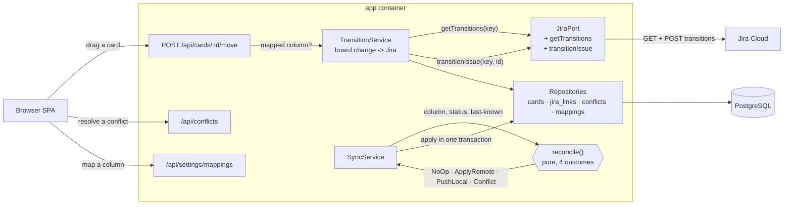
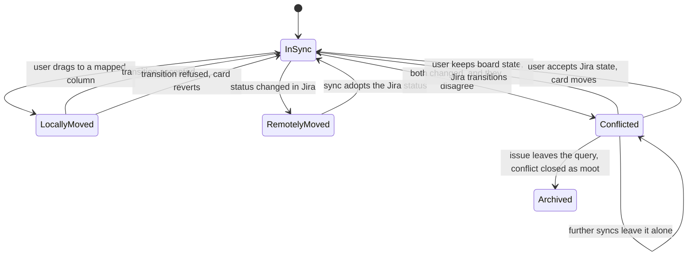

# Implementation Plan: Two-Way Sync

**Branch**: `003-two-way-sync` | **Date**: 2026-08-26 | **Spec**: [spec.md](spec.md)

**Verification**: [spec-verification.md](spec-verification.md) — Result: PASS
**Risk Tier**: FULL — this is the first slice that writes to a system other people can see.

## Summary

Make the board drive Jira: moving a card transitions its issue, changes made in
Jira move the card, and when both changed the board says so instead of guessing.

Three things shape the design, and the third was discovered by reading the
user's actual Jira rather than assuming:

1. **The sync decision is a pure function of three inputs** — the card's
   column, the issue's current status, and the last-known status recorded since
   slice 2. Four outcomes, nothing else consulted. That is what makes the whole
   matrix testable as a table.
2. **Conflicts are raised, never resolved.** Silent resolution either discards a
   decision the user made or clobbers a teammate's. Both are unrecoverable in
   the sense that matters: the user never learns it happened.
3. **A transition's name is not its destination.** Probed against
   tsgjira.atlassian.net on 2026-08-26: `Pass → PO Approve`,
   `To Development → Development`, `To Backlog → Open`. Matching on the
   transition's own name would fail on every one of those. The adapter matches
   on `transition.to.name`.

And one consequence worth stating plainly: **legal transitions are narrow**.
ABSARCH-11 offers only *Development* or *Cancelled*. A refused move is the
common case here, not an edge case, so the refusal path gets first-class
treatment rather than an error toast bolted on at the end.

## Technical Context

**Language/Version**: TypeScript 5.7 on Node 22 (unchanged)

**Primary Dependencies**: no new runtime dependency

**Storage**: PostgreSQL. One new table (`column_status_mappings`), one new
table (`conflicts`), one new column on `cards`.

**Testing**: Vitest (unit — the reconciler and its full truth table), contract
(the transition path against recorded fixtures), cucumber-js (acceptance
against the fake), Playwright (conflict resolution in the browser)

**Constraints**: no field other than issue status is ever written; a conflicted
card is frozen against both sync and the user; no test in the standard suite
contacts live Jira

**Scale/Scope**: tens of issues, one Jira site

## Constitution Check

| # | Principle | Verdict | How this plan satisfies it |
|---|---|---|---|
| I | Secure | PASS | No new credential surface — the same header from slice 2. The new risk is *authority*, not secrecy: this slice acts as the user inside Jira. Bounded by writing only status, only on issues already on the board, and only on an explicit user action or an explicit conflict resolution. |
| II | Composable | PASS | The reconciler is a pure function; the adapter gains two methods behind the existing port; the conflict store is its own repository. |
| III | Available | PASS (scoped) | An unreachable Jira degrades to a board that still moves cards locally and reports the failure. |
| IV | Resilient | PASS | Every write path has a defined failure: no legal transition, stale mapping, missing required field, unreachable. Each reverts the optimistic move and names its own cause. |
| V | Manageable | **DEVIATION (carried)** | README, not Confluence. Unchanged. |
| VI | Monitored | PASS | `sync_runs` gains conflict counts; conflicts are themselves a visible, queryable record. |
| VII | Deployable | PASS | No new container, no new configuration beyond the mapping, which has a working default. |
| VIII | Compliant | PASS (exempt) | No PII. Note: this slice *does* change data other people see, which is a different concern from compliance and is handled under Data lifecycle below. |
| IX | Reproducible | PASS | No new dependency. |
| X | Testable | PASS | The reconciler needs no I/O at all. The adapter's write path is contract-tested against recorded fixtures. |
| XI | Documented | PASS | The External Interactions Register gains the write touchpoint, including which transitions are attempted and what happens when none is legal. |
| XII | Simplicity First | PASS | No conflict auto-resolution, no merge strategies, no transition-screen field handling, no bulk operations. |
| XIII | Lean Footprint | PASS | Zero new dependencies. |
| XIV | Maintainability | PASS | Reconciler, adapter, conflict store and resolution service each have one reason to change. |

## Complexity Tracking

| Violation | Why Needed | Simpler Alternative Rejected Because |
|---|---|---|
| A `conflicts` table rather than a flag on `cards` | A conflict has its own state: the board column and Jira status *as at detection*, the current Jira status, when it was raised, and how it was resolved. That is an entity, not a boolean. | A flag cannot answer "what did each side say", which is the entire content of the resolution screen. |
| The reconciler duplicates knowledge the sync service could inline | Extracted precisely so it can be tested exhaustively without a database, a clock or a Jira. SC-203 requires all 16 input combinations covered; that is unreasonable through the HTTP layer and trivial as a table. | Inlining it makes the highest-risk logic in the project reachable only through integration tests. |
| Principle V — no Confluence runbook | Carried from slices 1 and 2. | Unchanged. |

## Architecture Review

| Category | Dimension | Decision or N/A reason |
|---|---|---|
| Cross-cutting | Authentication / authorization | Same outbound credential as slice 2. **Authority is the new concern**: this slice acts as the user in Jira. Bounded to status-only writes, only on issues already imported, only on explicit user action. The board itself still has no inbound auth. |
| Cross-cutting | Input validation & sanitization | The mapping is validated against the statuses Jira reports for the project, not free text — an unmatchable mapping is refused at configuration time rather than discovered at move time. |
| Cross-cutting | Error handling strategy | Four typed refusal causes, each distinct in the interface: `NoLegalTransition`, `StaleMapping`, `TransitionNeedsFields`, `JiraUnreachable`. FR-019 and FR-020 require the user to be told which. |
| Cross-cutting | Logging & observability | `sync_runs` gains conflict counts. Every write attempt is logged with its issue key and outcome — never the credential. |
| Cross-cutting | Secrets / config management | Unchanged from slice 2. |
| Cross-cutting | Idempotency | A transition request is idempotent in effect: asking Jira to move an issue to the status it already holds is either a no-op or has no legal transition, and both are handled. The reconciler is idempotent by construction — it computes desired state, not deltas. |
| Cross-cutting | Retries, timeouts, circuit breakers | Reads keep slice 2's backoff. **Writes are not retried.** A transition that failed may or may not have applied; repeating it risks a second, unwanted move. The next sync reconciles from observed truth instead. |
| Cross-cutting | Backwards compatibility / API versioning | Additive: `Card` gains a conflict marker, new endpoints under `/api/conflicts` and `/api/settings/mappings`. |
| Failure modes | Partial-failure behavior | A push is one transition on one issue; there is no partial state within it. A sync's apply phase remains one transaction. A conflict raised mid-sync does not prevent other cards from reconciling. |
| Failure modes | Downstream outage handling | Board moves still apply locally and revert with a stated reason if the transition cannot be attempted; the card is left in a state the next sync can reconcile. |
| Failure modes | Concurrent writes / race conditions | The issue's status can change between reading its legal transitions and requesting one. Jira rejects the stale request; the card reverts and the next sync reconciles from the new truth. This is why writes are not retried. |
| Failure modes | Replay / duplicate request handling | Covered by idempotency above; the single-flight lock still prevents overlapping syncs. |
| Integration | Integration boundaries | Jira gains a write direction. Registered in `docs/external-interactions.md` with the transitions attempted and the refusal causes. |
| Integration | Contract evolution strategy | `JiraPort` gains `getTransitions` and `transitionIssue`. Slice 2's `searchIssues` is unchanged, so the read path and its tests are untouched. |
| Integration | Cross-repo contract surface (dependency manifest) | N/A — no dependency manifest (single-codebase feature). |
| Data | PII / sensitive-data classification | No PII. |
| Data | Tenant isolation | N/A — one user, one Jira site. |
| Data | Data lifecycle | **This slice changes data outside the board, visible to other people.** Bounded three ways: only issue status, only issues already imported, only on an explicit action. Conflicts are retained after resolution as a record of what was decided. |
| Data | Money / decimal handling | N/A — the board holds work items, not amounts. Nothing in this slice reads, writes or compares a numeric value with financial meaning. |
| Operational | Deployment & rollback strategy | Unchanged. Rolling back to slice 2 leaves the board read-only; transitions already applied in Jira stay applied, which is correct — they were the user's decisions. |
| Operational | Schema / data migration plan | Two additive migrations plus one column. Forward-only, applied at start. |
| Alternatives | Alternatives considered + rejection rationale | See research.md. Chiefly: matching transitions by destination status rather than transition name (forced by the real workflow); refusing rather than auto-resolving conflicts; not retrying writes; and no support for transition screens requiring fields. |

## Architecture Diagram

### Component diagram

### State diagram — one Jira card

## Test Strategy

**Coverage Target**: all 26 behavior pathways, plus SC-203's requirement that
every combination of the reconciler's three inputs is covered.

| Test File | Type | Covers |
| --- | --- | --- |
| `tests/unit/reconcile.test.ts` | Unit | The full decision table: every combination of local-changed, remote-changed and agreement — BH-209…BH-214 |
| `tests/unit/mapping.test.ts` | Unit | Column-to-status lookup, unmapped columns, two columns sharing a status resolving by board order — BH-202, BH-224 |
| `tests/contract/jira-transitions.test.ts` | Contract | `getTransitions` and `transitionIssue` against recorded fixtures, including the real shape where transition name differs from destination — BH-201, BH-205, BH-208 |
| `tests/features/push-transitions.feature` | Acceptance | Move transitions the issue; unmapped and ad-hoc cards write nothing — BH-201, BH-202, BH-203, BH-204 |
| `tests/features/push-refusals.feature` | Acceptance | Illegal transition, stale mapping, unreachable Jira, transition needing fields — BH-205…BH-208 |
| `tests/features/adopt-remote.feature` | Acceptance | Remote-only change adopted and attributed to sync; unmapped inbound status leaves the card — BH-210, BH-211, BH-212 |
| `tests/features/conflicts.feature` | Acceptance | Raised, frozen, updated not duplicated, closed as moot — BH-213, BH-215, BH-221, BH-222 |
| `tests/features/conflict-resolution.feature` | Acceptance | Both resolutions, recorded, and a failed resolution leaving the conflict standing — BH-217…BH-220 |
| `tests/features/mapping-settings.feature` | Acceptance | Mapping set, removed, persisted; shared mapping by board order — BH-223, BH-224 |
| `tests/features/steps/transition.steps.ts` | Acceptance | Steps driving the fake's transition surface |
| `tests/e2e/conflict.spec.ts` | E2E | The conflict badge and the side-by-side resolution — BH-213, BH-216, BH-217, BH-218 |
| `tests/e2e/mapping.spec.ts` | E2E | Mapping a column in settings, and an unmapped column staying local |
| `tests/unit/no-unbounded-writes.test.ts` | Unit | The adapter writes only transitions: no other Jira endpoint, no other field — BH-204 |

**TestRail sync point**: each story's first task syncs its `TEST-###` cases
before any implementation task in that story runs. Cases land under a new
"Slice 3 — Two-Way Sync" section in project 115.

## TradeStation SDD — Required plan close-outs

- **Test Strategy is mandatory** — all 13 files become tasks.
- **Constitution Check** ran before Phase 0 and after Phase 1; the two new
  abstractions are justified in Complexity Tracking.
- **This slice writes to a system other people can see.** Verification against
  real Jira must be an explicit, separately agreed step — not a side effect of
  running a test suite.
