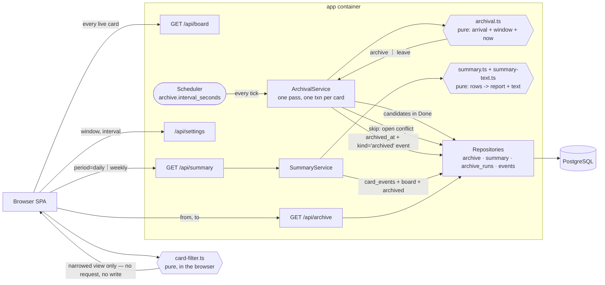
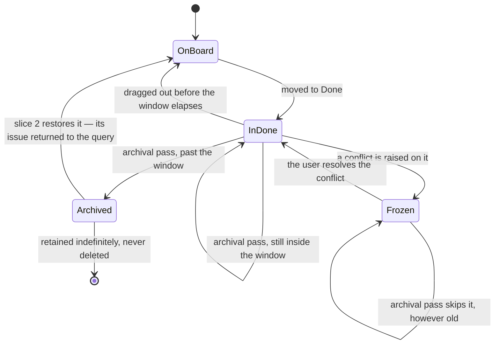

# Implementation Plan: Review and Reporting

**Branch**: `004-review-and-reporting` | **Date**: 2026-08-27 | **Spec**: [spec.md](spec.md)

**Input**: Feature specification from `/specs/004-review-and-reporting/spec.md`

## Summary

The board has been accumulating a record since slice 1 — every column change,
who caused it, and when. This slice makes that record useful: filter the board
in place to find a card, archive finished work automatically so Done stops
growing without bound, and generate the standup and weekly summaries the user
would otherwise assemble by hand.

Technically it is the quietest slice of the four. It adds **no outside
touchpoint** — everything it needs is already in PostgreSQL — and no new
dependency. Its one genuinely new property is that **archival acts on its own**,
without a user or Jira asking, which makes it the first thing in the system that
can change the board while nobody is watching. That is where the design
attention goes.

Three decisions shape it, all argued in [research.md](research.md): filtering
runs entirely in the browser over data already loaded (R-1); the archival window
is measured from the movement history rather than a maintained column (R-2); and
archival needs a second *kind* of history row, which required a schema change
the spec's Out-of-Scope section forbade until planning surfaced the
contradiction and the spec was amended (R-3, and the section below).

## Technical Context

**Language/Version**: TypeScript 5.7, Node 22 in the container (Node 26 locally)

**Primary Dependencies**: Fastify 5, React 19, `pg` 8, Zod 3 — all already
present. **Zero new runtime dependencies.**

**Storage**: PostgreSQL 17. Two additive migrations (013, 014), no data
migration, no backfill.

**Testing**: Vitest (unit, ops), `@cucumber/cucumber` 11 (acceptance),
Playwright 1.62 (browser). No contract suite this slice — there is no external
contract to test against.

**Target Platform**: Two Docker containers on the user's own machine, loopback
only.

**Project Type**: Web application — Fastify API serving a React SPA from one
port.

**Performance Goals**: SC-301 — a filter updates a 50-card board in under 200ms.
Met by construction (R-1): the filter is an array pass in the browser.

**Constraints**: Filtering must mutate nothing (FR-311, SC-303). Generating a
summary must mutate nothing (FR-331, SC-308). Archived cards must never be
deleted (FR-316, SC-305).

**Scale/Scope**: One user. Tens of live cards, tens of archived cards a month,
a few thousand history rows a year.

## Constitution Check

*GATE: passed before Phase 0 research; re-checked after Phase 1 design.*

| # | Principle | Verdict | How this plan satisfies it |
|---|---|---|---|
| I | Secure | PASS | No new credential surface, no new outbound call, no new inbound route that writes on behalf of anyone. The archive exposes cards the user already owns. |
| II | Composable | PASS | Filtering, the archival rule and the summary builder are each pure functions over data passed in. The scheduler that drives archival is the class slice 2 already built. |
| III | Available | PASS | Nothing here can make the board unavailable: filtering is client-side, and a failed archival pass leaves every card exactly where it was and retries on the next tick. |
| IV | Resilient | PASS | Archival is idempotent — it selects cards past the window and marks them; running it twice archives nothing twice. A failure mid-pass rolls back one card, not the batch. |
| V | Manageable | **DEVIATION (carried)** | README rather than a Confluence runbook. Unchanged from slices 1–3. |
| VI | Monitored | PASS | Each archival pass records what it archived, in the same shape as `sync_runs`. Without it, a process that acts unobserved has no trace — the lesson slice 3's live check taught at some cost. |
| VII | Deployable | PASS | No new container. One new setting with a working default. `TZ` becomes explicit in compose (R-7), which is a correction, not a new requirement. |
| VIII | Compliant | PASS (exempt) | No PII. The archive retains the user's own notes about their own work. |
| IX | Reproducible | PASS | Zero new dependencies. |
| X | Testable | PASS | The three pieces of real logic — filter matching, archival eligibility, summary building — are pure and take their clock as an argument, so every boundary case is a unit test rather than a scenario with a sleep in it. |
| XI | Documented | PASS | No External Interactions Register change is needed, and that absence is itself worth stating: this slice adds no touchpoint. README gains the filter, the archive and the summaries. |
| XII | Simplicity First | PASS | No saved filters, no full-text search, no export, no charts, no manual un-archive — all explicitly out of scope and none of them snuck in. |
| XIII | Lean Footprint | PASS | Zero new dependencies. Clipboard copy uses the platform API. |
| XIV | Maintainability | PASS | Each new module has one reason to change: `card-filter` when filtering rules change, `archival` when the window rule does, `summary` when the report's content does. |

**Re-check after Phase 1 design**: still PASS. The design added one thing the
first pass had not anticipated — the `kind` column on `card_events` (R-3) —
recorded under Complexity Tracking below.

## Project Structure

### Documentation (this feature)

```text
specs/004-review-and-reporting/
├── plan.md              # This file
├── research.md          # Phase 0 — eight decisions with rejected alternatives
├── data-model.md        # Phase 1 — two migrations, one setting, no new entity
├── contracts/api.md     # Phase 1 — three read endpoints, one setting
├── quickstart.md        # Phase 1 — how to see each of the three features work
├── spec.md              # Input
└── tasks.md             # Phase 2 — /speckit.tasks, not this command
```

### Source Code (repository root)

New files are marked `+`; everything else is existing and touched.

```text
src/
├── domain/
│   +── card-filter.ts          # Pure: does this card match this filter?
│   +── archival.ts             # Pure: given arrival time, window and now — archive?
│   +── summary.ts              # Pure: history + board -> structured summary
│   +── summary-text.ts         # Pure: structured summary -> plain text
│   └── overdue.ts              # Reused for the calendar-day boundary (R-7)
├── server/
│   ├── db/migrations/
│   │   +── 013_card_events_kind.sql
│   │   +── 014_archive_runs.sql
│   ├── repositories/
│   │   +── archive-repository.ts    # Candidates, archive one, read by date range
│   │   +── summary-repository.ts    # History + board rows for a period
│   │   +── archive-run-repository.ts
│   │   └── event-repository.ts      # Gains the archived-kind write
│   ├── services/
│   │   +── archival-service.ts      # One pass: select, skip conflicted, archive
│   │   +── summary-service.ts
│   ├── routes/
│   │   +── archive.ts
│   │   +── summary.ts
│   │   └── settings.ts              # Gains the window and interval
│   └── app.ts                       # Wires the second scheduler
└── web/
    ├── board/
    │   ├── Board.tsx                # Hosts the filter bar; filters before render
    │   +── FilterBar.tsx
    │   +── use-filter.ts
    ├── archive/
    │   +── ArchiveView.tsx
    └── summary/
        +── SummaryDialog.tsx

tests/
├── unit/         + card-filter, archival, summary, summary-text
├── features/     + filtering, archival, archive-view, summaries
├── e2e/          + filter.spec.ts, summary.spec.ts, archive.spec.ts
└── ops/          (unchanged)
```

**Structure Decision**: unchanged from slices 1–3 — pure logic in `src/domain`,
data access in `src/server/repositories`, orchestration in
`src/server/services`, HTTP in `src/server/routes`, interface in `src/web`. This
slice adds no new layer and no new top-level directory.

## Complexity Tracking

| Violation | Why Needed | Simpler Alternative Rejected Because |
|---|---|---|
| `card_events` gains a `kind` column, relaxing a slice-1 constraint | FR-317 requires archival in the movement history with the system as actor, but an archived card is already in Done, and the table forbids an event whose from- and to-column are equal. The record the requirement demands is currently impossible to write. See R-3. | A separate `card_archivals` table splits "what happened to this card" across two tables, so every reader must union them — and the reader that forgets is the bug. Dropping the constraint entirely would discard a guard (FR-028: a reorder writes no row) that has nothing to do with this problem. |
| A second `Scheduler` instance rather than archiving inside the sync | Different cadences (hourly vs five-minutely) and different failure domains. Folding archival into the sync makes the board's Jira freshness depend on something unrelated to Jira. See R-5. | Sharing the sync's tick means 288 pointless passes a day, and one slow archival delays a sync for no reason a user could explain. |
| `archive_runs`, a second run-log table shaped like `sync_runs` | This is the first process in the system that changes the board with nobody watching. Slice 3's live check found an unrequested write *only* because a log existed to find it in. An unobserved automatic process is exactly where the next such defect will hide. | Logging to stdout only: gone on container restart, and not answerable from the interface when a user asks where a card went. |
| Principle V — no Confluence runbook | Carried from slices 1–3. | Unchanged. |

## Spec contradiction — raised here, resolved in the spec

When this plan was first written, `spec.md`'s Out of Scope said:

> Any change to how movement history is written, which Slices 1 through 3 own.

FR-317 requires archival to be recorded in that history, and BH-312 verifies it
— but as R-3 shows, an eligible card is already in Done, so the record the
requirement demands was one the history could not hold. The two statements could
not both stand, and the choice between them would otherwise have been made
silently, inside a migration.

**Resolved in the spec on 2026-08-27**, not here. The exclusion now reads "any
change to how **movements** are recorded", FR-317 states that archival is a
distinct kind of record, and the reasoning is in the spec's Clarifications under
Session 2026-08-27. `spec-verification.md` re-ran the full gate afterwards and
passes.

The same amendment added **FR-318a** — a card with an unresolved conflict is
never archived — with BH-309a and TEST-309a. That rule began as this plan's R-4:
the spec predates slice 3 and did not contemplate conflicts and archival
meeting, so without the amendment the behaviour would have been decided by
whichever code happened to run first. It is now a requirement with a pathway and
a test, which is where a rule like that belongs.

**Twenty-three pathways, twenty-three verification rows**, one-to-one.

## Architecture Review

| Category | Dimension | Decision or N/A reason |
|---|---|---|
| Cross-cutting | Authentication / authorization | N/A — no login by design (BRD D-9, loopback only), and this slice adds no route that acts on anyone's behalf. Unchanged from slices 1–3. |
| Cross-cutting | Input validation & sanitization | Date ranges and the period selector are parsed with Zod at the route; an unparseable range is refused rather than silently defaulted. Filter text never reaches the server (R-1), so it has no injection surface at all. |
| Cross-cutting | Error handling strategy | Reuses slice 1's typed `DomainError` codes. One new code, `INVALID_DATE_RANGE`, for a `from` later than its `to` — distinguishable from an empty result, which is a success (FR-323). |
| Cross-cutting | Logging & observability | `archive_runs` records every pass: when, how many archived, and the outcome. Chosen deliberately — see Complexity Tracking. Each archived card is also logged with its id and age. |
| Cross-cutting | Secrets / config management | N/A — this slice reads no credential. The two new settings (window, interval) are ordinary integers with defaults. |
| Cross-cutting | Idempotency | Archival is idempotent by construction: it selects on `archived_at IS NULL` and sets it. A second pass over the same card selects nothing. Summaries and archive reads are pure reads. |
| Cross-cutting | Retries, timeouts, circuit breakers | No retry: a failed archival pass simply does not archive this hour, and the next tick reconsiders the same cards. There is nothing time-critical to retry *for*. The database statement timeout from slice 1 still applies. |
| Cross-cutting | Backwards compatibility / API versioning | Purely additive: `GET /api/archive`, `GET /api/summary`, two settings keys. `card_events` gains a defaulted column; existing responses are unchanged. |
| Failure modes | Partial-failure behavior | Each card is archived in its own transaction — the history row and the `archived_at` update together. A pass that dies halfway leaves earlier cards archived and later ones untouched, which is exactly what the next pass expects to find. Batching them into one transaction would mean one bad card blocks all of them. |
| Failure modes | Downstream outage handling | The only downstream is PostgreSQL. Unreachable means the archival pass fails and is recorded as failed; the board's existing degraded behaviour is unchanged. |
| Failure modes | Concurrent writes / race conditions | The real one: **a user dragging a card out of Done while archival is selecting it.** Each card is re-checked under `SELECT … FOR UPDATE` inside its own transaction, so the move either lands first (and the card is no longer eligible) or waits (and finds the card archived). Single-flight prevents two passes overlapping. |
| Failure modes | Replay / duplicate request handling | N/A — the three new endpoints are reads, and a repeated read changes nothing. Archival's replay case is covered by the Idempotency row above: a second pass selects on `archived_at IS NULL` and finds nothing. |
| Integration | Integration boundaries (callers + dependencies) | **No new touchpoint.** This slice reads data the board already holds. `docs/external-interactions.md` needs no new entry, and the absence is worth recording explicitly. |
| Integration | Contract evolution strategy | The board response is unchanged, so the existing client keeps working. Filtering is invisible to the API. |
| Integration | Cross-repo contract surface (dependency manifest) | N/A — no dependency manifest (single-codebase feature). |
| Data | PII / sensitive-data classification | No PII. Card titles and descriptions are the user's own notes; the archive retains them longer, which is its purpose. |
| Data | Tenant isolation | N/A — one user, one board. |
| Data | Data lifecycle | **Retention is indefinite and deliberate**: FR-316 forbids deletion, SC-305 requires 100% retrievable. Nothing in this slice deletes a card, and the archive query never touches `deleted_at` rows. There is no purge, and adding one would need its own decision. |
| Data | Money / decimal handling | N/A — the board holds work items. The only arithmetic is counting days. |
| Operational | Deployment & rollback strategy | Unchanged: `docker compose up`. Rolling back to slice 3 leaves `archived_at` set on cards this slice archived, so they stay off the board — correct, since they were finished. The `kind` column is ignored by slice-3 code. |
| Operational | Schema / data migration plan | Two additive, forward-only migrations applied at start. `kind` defaults to `'moved'`, so no backfill: every existing row already means what the default says. |
| Alternatives | Alternatives considered + rejection rationale | See research.md — chiefly client-side filtering over server-side search (R-1), reading the arrival time from history rather than maintaining a column (R-2), a `kind` column over a second table (R-3), refusing to archive conflicted cards (R-4), and a separate scheduler over sharing the sync's (R-5). |

## Architecture Diagram

### Component diagram



### State diagram — one card reaching Done



## Test Strategy

**Coverage Target**: all 23 behavior pathways (BH-301…BH-322, including
BH-309a), plus SC-302's
requirement that filter combinations return exactly their intersection and
SC-303/SC-308's requirement that filtering and summarising mutate nothing.

**Test Framework**: Vitest (unit, ops), cucumber-js (acceptance), Playwright
(browser).

**Test Types**: unit, acceptance, browser. **No contract tests** — this slice
talks to nothing outside the process, which is the reason there is no contract
to record.

| Test File | Type | Covers |
| --- | --- | --- |
| `tests/unit/card-filter.test.ts` | Unit | Every filter kind and every combination, including the empty filter and the filter matching nothing — BH-301…BH-304 |
| `tests/unit/archival.test.ts` | Unit | The window boundary exactly: one second under, exactly on, one second over; the zero window; the created-in-Done fallback — BH-309, BH-310 |
| `tests/unit/summary.test.ts` | Unit | Grouping into moved, in progress and blocked; sync-attributed movements marked; the empty period — BH-316, BH-319, BH-321 |
| `tests/unit/summary-text.test.ts` | Unit | The rendered plain text, line by line, including issue keys — BH-318, BH-320 |
| `tests/features/filtering.feature` | Acceptance | Filters narrow the board and nothing moves — BH-305 |
| `tests/features/archival.feature` | Acceptance | Eligibility, the configurable window, the card that left Done and returned, and the conflicted card that is never archived — BH-309, BH-309a, BH-310…BH-312 |
| `tests/features/archive-view.feature` | Acceptance | Date range, grouping, retained detail, recorded reason, empty range — BH-313…BH-315 |
| `tests/features/summaries.feature` | Acceptance | Daily and weekly, archived cards included, both sources, mutating nothing across twenty generations — BH-317, BH-322 |
| `tests/features/steps/reporting.steps.ts` | Acceptance | Steps for ageing a card into Done, running an archival pass, and reading a summary |
| `tests/e2e/filter.spec.ts` | Browser | Filter in place with all six columns visible, the empty-filtered board explaining itself, keyboard reach, and clearing on reload — BH-305…BH-308 |
| `tests/e2e/summary.spec.ts` | Browser | Open the summary and copy it — the two interactions SC-306 allows — BH-320 |
| `tests/e2e/archive.spec.ts` | Browser | Browse the archive by range and open an entry — BH-313, BH-314 |

Twelve files, all of which become tasks.

**TestRail sync point**: each story's first task syncs its `TEST-###` cases via
`spec-testrail-sync` before any implementation task in that story runs. Cases
land under a new "Slice 4 — Review and Reporting" section in project 115,
suite 32733.

## TradeStation SDD — Required plan close-outs

- **Test Strategy is mandatory.** All twelve files above become tasks.
- **Constitution Check** ran before Phase 0 and again after Phase 1 design; the
  one thing the second pass added is recorded in Complexity Tracking.
- **This slice writes nothing outside the board.** Unlike slice 3, no live
  verification against another system is needed — but archival acts unobserved,
  so `archive_runs` and per-card logging take that role.
- **The spec contradiction this plan raised is resolved** in the spec itself
  (see the section above), not worked around here. The spec re-passed
  verification afterwards.
