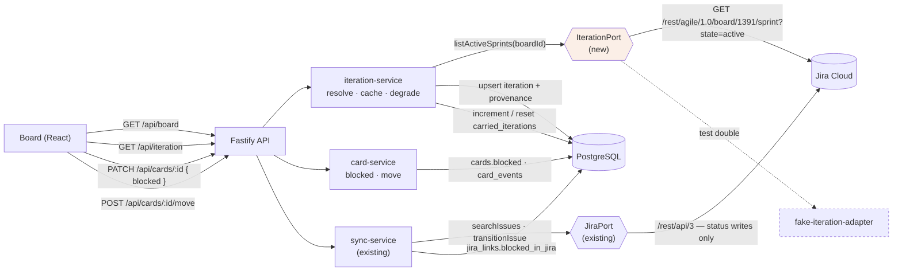
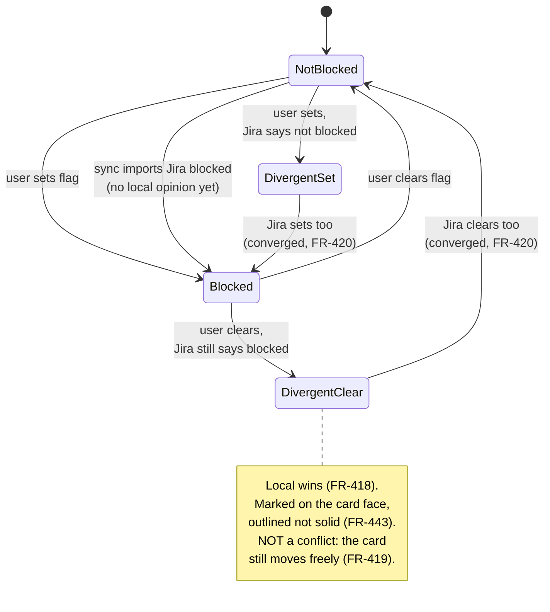

# Implementation Plan: Iteration and Board Restructure

**Branch**: `005-iteration-and-board-restructure` | **Date**: 2026-08-26 | **Spec**: [spec.md](spec.md)

**Input**: Feature specification from `/specs/005-iteration-and-board-restructure/spec.md`

## Summary

Three changes to a board that already works. The six columns become Backlog,
Iteration Items, In Progress, Test, PO Review, Done — Blocked leaves the board
and becomes a flag the card carries wherever it actually is. The board learns
the current TradeStation iteration from a nominated Jira board and shows it in
a banner that degrades to a cache and then to an estimate rather than ever
failing. And cards left unfinished across a boundary say so on their face.

The technical shape follows one finding from Phase 0 that the spec did not
anticipate: **the Blocked column cannot be deleted**, because the append-only
movement history holds foreign keys into it. It is retired instead — absent
from the board, present as a historical referent (research R-1). That single
constraint shapes the migration, the board query and the move path.

## Technical Context

**Language/Version**: TypeScript 5, Node 22, ES modules throughout

**Primary Dependencies**: Fastify (server), React 19 + Vite (web), `pg` (driver,
no ORM), `@dnd-kit` (drag), Zod (request validation). **No new runtime
dependency is added by this slice.**

**Storage**: PostgreSQL 16 on a named Compose volume. Migrations are plain SQL
applied in order at process start by `src/server/db/migrate.ts`.

**Testing**: Vitest (unit, contract, ops), cucumber-js (acceptance, Gherkin),
Playwright (end-to-end in Compose).

**Target Platform**: Two containers on the user's own machine, bound to
loopback. Single user, no authentication layer (constitution deviation carried
from Slice 1).

**Project Type**: Web application — Fastify API and React front end in one
repository, sharing types through `src/shared/`.

**Performance Goals**: Board load under 1s against the local database (SC-407),
with roughly 50 cards visible per column without scrolling (FR-441).

**Constraints**: Iteration resolution must never delay board load or surface as
an error (FR-429, FR-430). No Jira field other than status may be written
(FR-417, inherited BR-22).

**Scale/Scope**: One user, tens of cards, one Jira instance. Six migrations,
one new port, one new table, three new card attributes.

## Constitution Check

*GATE: passed before Phase 0 research; re-checked after Phase 1 design.*

| # | Principle | Verdict | How this plan satisfies it |
|---|---|---|---|
| I | Secure | PASS | One new outbound read to a host already trusted and already authenticated by the same credential, from the same server-side boundary. No new inbound route writes on anyone's behalf. Settings gain field identifiers, which are configuration, not credentials — `007_settings.sql`'s standing rule that there is nowhere to put a credential is unchanged. |
| II | Composable | PASS | Sprint selection, working-day counting and carry-over increment are pure functions taking their inputs as arguments. The iteration source sits behind its own port (R-7) rather than being folded into `JiraPort`. |
| III | Available | PASS | Every failure path of the new dependency ends in a cached or estimated value. There is no arrangement of Jira being down that makes the board less usable than it is today. |
| IV | Resilient | PASS | The migration is idempotent by construction (FR-407): its statements match zero rows on a second run. Iteration resolution is a read with no side effect beyond an upsert. |
| V | Manageable | **DEVIATION (carried)** | README rather than a Confluence runbook. Unchanged from slices 1–4; not introduced here. |
| VI | Monitored | PASS | Each resolution records its outcome and provenance in `iterations.source`/`observed_at`, so a banner showing a stale value can always be traced to when it was last read. The migration writes one `system`-attributed history row per card it moves. |
| VII | Deployable | PASS | No new container, no new port, no new environment variable. Eleven new settings, all with working defaults verified against the live instance. |
| VIII | Compliant | PASS (exempt) | No PII. Sprint names and dates are the user's own team's schedule. |
| IX | Reproducible | PASS | Zero new dependencies. |
| X | Testable | PASS | The three pieces of real logic — sprint selection, working-day arithmetic, carry-over transition — are pure and take their clock as an argument. The new port has a fake, so no test in the standard suite reaches Jira (FR-442). |
| — | *Quality gate: ≥90% coverage* | **DEVIATION (carried)** | No coverage provider is installed, and slices 1–4 never measured one either. The suite passes and every behavior pathway is pinned to a test, but **no percentage is claimed**. Raised by `/speckit.analyze` (B-2); resolved by recording the deviation rather than asserting a gate nobody can evaluate. |
| XI | Documented | **ACTION REQUIRED** | This slice **adds an external touchpoint**: the Jira Agile API. `docs/external-interactions.md` gains an entry in the same change, per the standing quality gate. This is the first slice since Slice 3 to move that file. |
| XII | Simplicity First | PASS | No iteration lookahead, no per-card sprint badge, no sprint sync, no burndown. All named out of scope in the spec and none has crept in. |
| XIII | Lean Footprint | PASS | Zero new dependencies; the banner is markup and the marker is CSS. |
| XIV | Maintainability | PASS | Each new module has one reason to change: `iteration-service` when resolution rules change, `working-days` when the calendar does, `carry-over` when the reset rule does. |

**Re-check after Phase 1 design**: still PASS, with one addition the first pass
had not anticipated — retiring rather than deleting the Blocked column (R-1),
which introduces `columns.retired_at` and makes `columns.position` nullable.
Recorded under Complexity Tracking below.

## Project Structure

### Documentation (this feature)

```text
specs/005-iteration-and-board-restructure/
├── plan.md                 # This file
├── research.md             # Phase 0 — eleven decisions with rejected alternatives
├── data-model.md           # Phase 1 — six migrations, one new table
├── contracts/api.md        # Phase 1 — one new endpoint, three changed surfaces
├── quickstart.md           # Phase 1 — how to see each part work
├── spec.md                 # Input
├── spec-verification.md    # Gate record — PASS
└── tasks.md                # Phase 2 — /speckit.tasks, not this command
```

### Source Code (repository root)

```text
src/
├── shared/
│   └── types.ts                        # CHANGED: COLUMN_KEYS, Card, Column, new Iteration type
├── domain/
│   ├── sprint-selection.ts             # NEW: pure — pick the team's sprint from active sprints
│   ├── working-days.ts                 # NEW: pure — working days remaining in a span
│   └── carry-over.ts                   # NEW: pure — should this card's count increment or reset
├── server/
│   ├── db/migrations/
│   │   ├── 016_retire_blocked_column.sql    # NEW
│   │   ├── 017_card_blocked.sql             # NEW — includes the card migration
│   │   ├── 018_jira_blocked.sql             # NEW
│   │   ├── 019_iterations.sql               # NEW
│   │   ├── 020_carry_over.sql               # NEW
│   │   └── 021_iteration_settings.sql       # NEW
│   ├── jira/
│   │   ├── iteration-port.ts           # NEW — R-7
│   │   ├── iteration-adapter.ts        # NEW — real, /rest/agile/1.0
│   │   └── fake-iteration-adapter.ts   # NEW — the suite's double
│   ├── repositories/
│   │   ├── iteration-repository.ts     # NEW
│   │   ├── board-repository.ts         # CHANGED: filter retired columns; project new fields
│   │   ├── card-repository.ts          # CHANGED: blocked, carry-over
│   │   └── settings-repository.ts      # CHANGED: eleven new settings
│   ├── services/
│   │   ├── iteration-service.ts        # NEW — resolve, cache, degrade
│   │   └── carry-over-service.ts       # NEW — increment on observed boundary
│   ├── sync/sync-service.ts            # CHANGED: import blocked; never fill Iteration Items
│   └── routes/
│       ├── iteration.ts                # NEW — GET /api/iteration
│       ├── cards.ts                    # CHANGED: accept blocked; reject retired target
│       └── settings.ts                 # CHANGED: validate the new settings
└── web/
    ├── board/
    │   ├── IterationBanner.tsx         # NEW
    │   ├── CardView.tsx                # CHANGED: blocked edge + badge, divergence, carry-over
    │   └── use-filter.ts               # CHANGED: blocked filter
    ├── cards/CardDialog.tsx            # CHANGED: blocked control
    ├── settings/SettingsDialog.tsx     # CHANGED: iteration + working days + field ids
    └── styles/tokens.css               # CHANGED: --column-blocked retires into --blocked
```

**Also changed, named here so the drift heuristic does not fire on them**
(raised by `/speckit.analyze`, N-1):

```text
src/server/app.ts                                # register the iteration route
src/server/jira/jira-adapter.ts                  # read the blocked field (FR-416)
src/server/repositories/jira-link-repository.ts  # persist blocked_in_jira
src/server/repositories/summary-repository.ts    # blocked grouping by flag (FR-415)
src/server/repositories/board-row.ts             # project the three new card fields
src/server/services/card-service.ts              # reject a retired target (FR-402)
src/server/services/summary-service.ts           # blocked grouping by flag (FR-415)
src/web/App.tsx                                  # mount the banner outside board load
src/web/board/Board.tsx                          # the six new columns
src/web/board/ColumnView.tsx                     # column colours
src/web/board/Sidebar.tsx                        # blocked filter control
```

**Read, not modified** — referenced by tasks as existing mechanism:
`src/server/errors.ts`, `src/domain/backoff.ts`, `src/server/sync/sync-lock.ts`,
`src/server/sync/transition-service.ts`.

**Structure Decision**: The existing layout is kept exactly. Pure logic goes to
`src/domain/` beside `jql.ts`, which is where this codebase already puts
functions that must be unit-testable without I/O. The new port sits in
`src/server/jira/` next to the existing one because it addresses the same host,
even though it is a separate interface.

## Complexity Tracking

| Violation | Why Needed | Simpler Alternative Rejected Because |
|-----------|------------|-------------------------------------|
| `columns.retired_at` and nullable `columns.position` — a column table that outlives the board | `card_events` holds foreign keys into every column a card has ever occupied (R-1), which FR-446 now states as an obligation in the spec itself. Deleting the Blocked row breaks the append-only history the whole product's reporting rests on. | Deleting the row breaks referential integrity. Repurposing the row as Iteration Items keeps the keys valid but retroactively rewrites history — every past "moved to Blocked" would render as "moved to Iteration Items". |
| A second Jira port rather than two more methods on `JiraPort` | The iteration source fails *silently by design* (FR-430), where every existing `JiraPort` failure must be loud. Same host, opposite contract. | Extending `JiraPort` is one file cheaper but puts degrade-silently and fail-loudly methods behind one interface, which is precisely the distinction its doc comment exists to protect. |
| Four settings written but not read in this slice | `jira.field.sprint`, `jira.field.story_points`, `working.start_hour`, `working.end_hour` are consumed by Slice 6. Their values are verified live *today*. | A settings migration in Slice 6 for values already known and validated now, at the cost of a second migration touching the same table. |

## Architecture Review

| Category | Dimension | Decision or N/A reason |
|---|---|---|
| Cross-cutting | Authentication / authorization | N/A — single user on loopback with no auth layer, carried from Slice 1's constitution deviation. The new outbound call reuses the existing Jira credential from env; no new credential surface. |
| Cross-cutting | Input validation & sanitization | Eleven new settings validated with Zod at the route boundary — bounds on cadence and hours, a subset check on working days, and a `^customfield_\d+$` pattern on field ids. See contracts/api.md. |
| Cross-cutting | Error handling strategy | Two regimes, deliberately different. Iteration failures never reach the user (FR-430) and degrade through cache to estimate. Move rejection into a retired column is a typed 422 `COLUMN_RETIRED`, following the existing typed-error shape in `src/server/errors.ts`. |
| Cross-cutting | Logging & observability | Provenance is persisted, not just logged: `iterations.source` and `observed_at` mean a stale banner can always be traced to its last successful read. The migration's effect is observable in `card_events` as `system`-attributed rows. |
| Cross-cutting | Secrets / config management | No new secret. Field identifiers and board id are configuration and live in `settings`, which by standing rule has nowhere to put a credential. The Jira credential stays in the gitignored `.env`, server-side only. |
| Cross-cutting | Idempotency | The migration is idempotent by construction (FR-407) — its statements match zero rows on re-run. Iteration resolution upserts on `ordinal_name`, so repeated resolution of the same sprint converges. |
| Cross-cutting | Retries, timeouts, circuit breakers | The new read reuses the existing adapter's backoff and timeout policy (`src/domain/backoff.ts`, exercised by `tests/unit/backoff.test.ts`). No new policy is introduced; exhausted retries fall to cache rather than to an error. |
| Cross-cutting | Backwards compatibility / API versioning | N/A — single-user local app with no external API consumer. The board payload gains three fields, which is additive; no field is removed or retyped. |
| Failure modes | Partial-failure behavior | The migration runs in one transaction: either every blocked card moves with its history row, or none does. Iteration resolution is a read, so a partial result is simply no result and takes the cache path. |
| Failure modes | Downstream outage handling | Jira unreachable is a first-class state, not an exception: cache, then estimate, then an empty banner, with the board fully interactive in all three (FR-426, FR-428, FR-429). Tested explicitly in quickstart step 3. |
| Failure modes | Concurrent writes / race conditions | Iteration resolution runs inside the existing sync lock (`src/server/sync/sync-lock.ts`), so it cannot overlap a scheduled poll or a manual refresh — the guarantee NFR-07 already required for sync. |
| Failure modes | Replay / duplicate request handling | Re-resolving the same sprint upserts to an identical row. Re-running the migration writes nothing. Neither can double-count carry-over, because the increment is keyed on `iteration_seen` changing. |
| Integration | Integration boundaries | Two outbound: PostgreSQL (existing) and Jira (existing host, **new API surface**). Both server-side. Registered in `docs/external-interactions.md` as part of this change. |
| Integration | Contract evolution strategy | Jira field identifiers are configurable (FR-438) precisely so a Jira administration change is a settings edit rather than a code change. The Agile sprint shape is narrow — id, name, two nullable dates — which limits exposure to upstream change. |
| Integration | Cross-repo contract surface (dependency manifest) | N/A — no dependency manifest (single-codebase feature). |
| Data | PII / sensitive-data classification | N/A — no PII. Sprint names and dates are the user's own team's schedule; card content is the user's own notes about their own work. |
| Data | Tenant isolation | N/A — single user, single tenant, no multi-tenancy anywhere in the product. |
| Data | Data lifecycle | Nothing is deleted by this slice. The Blocked column is retired rather than dropped precisely to preserve history (R-1). `iterations` rows accumulate at roughly 26 a year and are never pruned; Slice 6 reads them. |
| Data | Money / decimal handling | N/A — not a financial feature. No monetary or decimal quantity appears. |
| Operational | Deployment & rollback strategy | `docker compose up` as before; migrations apply at process start. Rollback is not automatic: the migration moves cards, so reverting the image without reverting the data would leave cards in a column the old code expects to be Blocked. Recorded as a risk below. |
| Operational | Schema / data migration plan | Six migrations, `016`–`021`, detailed in data-model.md. The only data-moving one is `017`, covered by a dedicated test asserting no card is lost (NFR-27, TEST-402). |
| Alternatives | Alternatives considered + rejection rationale | Eleven decisions with their rejected alternatives in research.md. The three consequential ones — retire rather than delete, a separate iteration port, and counting carry-over at the boundary rather than deriving it on read — are also in Complexity Tracking above. |

**Drift signal**: `/speckit.feedback`'s architecture-drift heuristics
(`new_top_level_dirs_since_plan`, `new_runtime_dependencies`,
`files_outside_planned_paths`) compare HEAD against this plan at story-complete
and end-of-feature. This slice expects **zero** new top-level directories and
**zero** new runtime dependencies; a non-zero value on either is a real signal,
not noise.

## Architecture Diagram

### Component diagram



### State diagram — one card's blocked state against Jira's



## Test Strategy

**Coverage Target**: **Not measured — carried deviation, see the Constitution
Check above.** No coverage provider is installed and no slice has ever recorded
a figure. What is enforced instead: every behavior pathway is pinned to a test,
and every entry in the External Interactions Register is exercised by an
integration test — including the new Agile touchpoint.

**Test Framework**: Vitest (unit, contract, ops), cucumber-js (acceptance),
Playwright (end-to-end).

**Test Types**: unit for the three pure functions; contract for the new port
and the changed payloads; acceptance for the six user stories; ops for the
migration; end-to-end for what only a browser can prove (the card's visual
treatment, keyboard operation, density).

| Test File | Type | Covers |
| --- | --- | --- |
| `tests/unit/sprint-selection.test.ts` | Unit | BH-417, BH-418 — team-name match, undated sprint, lowest-id tiebreak |
| `tests/unit/working-days.test.ts` | Unit | BH-416 — remaining-days arithmetic across weekends and configured days |
| `tests/unit/carry-over.test.ts` | Unit | BH-424, BH-432 — increment on boundary, reset on Done and on Backlog |
| `tests/unit/blocked-divergence.test.ts` | Unit | BH-412, BH-414 — local wins, convergence clears |
| `tests/unit/iteration-provenance.test.ts` | Unit | BH-419, BH-420, BH-422 — read/cached/estimated selection and elapsed-iteration handling |
| `tests/ops/migration-016-021.test.ts` | Ops | BH-401, BH-402, BH-403, BH-404, BH-405, BH-433 — column set, card migration, conflicted card, idempotence, mapping removal, retained history. **NFR-27's no-card-lost assertion lives here.** |
| `tests/contract/iteration-api.test.ts` | Contract | BH-416, BH-419, BH-420, BH-421 — `GET /api/iteration` shape and its never-5xx guarantee |
| `tests/contract/board-payload.test.ts` | Contract | BH-406 — new card fields; retired columns absent |
| `tests/unit/no-jira-writes.test.ts` | Unit | BH-415 — extends the existing assertion to the blocked field. Already exists at this path; this slice extends it rather than adding a file. |
| `tests/contract/retired-column.test.ts` | Contract | BH-401 — move into a retired column is refused |
| `tests/features/blocked-flag.feature` | Acceptance | US1 — set, clear, move while blocked, filter, summary grouping |
| `tests/features/iteration-banner.feature` | Acceptance | US2 — read, cached, estimated, non-blocking |
| `tests/features/iteration-items.feature` | Acceptance | US3 — placement, no Jira request, sync never fills it |
| `tests/features/blocked-from-jira.feature` | Acceptance | US4 — import, local override, divergence, convergence |
| `tests/features/carry-over.feature` | Acceptance | US5 — survives a boundary, counts, resets |
| `tests/features/iteration-settings.feature` | Acceptance | US6 — change board and team, persist across restart |
| `tests/e2e/blocked-card.spec.ts` | E2E | BH-427 — edge and badge visible, distinguishable without colour, keyboard-operable |
| `tests/e2e/iteration-banner.spec.ts` | E2E | BH-428 — banner present with ~50 cards, no column scrolling |
| `tests/ops/no-live-services.test.ts` | Ops | BH-429 — no adapter resolving to a real network client is constructed anywhere in the standard suite |

**TestRail sync point**: the first task in each user story's phase that carries
a `BH-###`/`TEST-###` pair authors or syncs that case through
`spec-testrail-sync` **before** any implementation task in the same story runs.
For this slice that means US1's first task syncs TEST-401…TEST-405 and
TEST-406…TEST-408 before the migration is written.

## TradeStation SDD — Required plan close-outs

- **Test Strategy is mandatory.** All nineteen test files above MUST become
  tasks in `/speckit.tasks`.
- **Constitution Check** ran before Phase 0 research and again after Phase 1
  design; both recorded above.
- **Principle XI action**: `docs/external-interactions.md` gains the Jira Agile
  API entry in this same change. This is a standing quality gate, not a
  suggestion — the register moves whenever a touchpoint does.

## Risks carried into implementation

| # | Risk | Mitigation |
|---|---|---|
| P-1 | Rolling back the image without rolling back the data leaves cards in In Progress that the old code expects in Blocked | The old code reads `column_id` and would simply show them in In Progress, unflagged — degraded, not broken. Documented in the README's upgrade note rather than engineered around, because this is a single-user local deployment. |
| P-2 | A later change "finishes the job" by dropping the retired Blocked row | R-1's reasoning is recorded in the migration file itself as a comment, not only in this plan. The ops test asserts the row still exists. |
| P-3 | The card meta row now carries priority, due date, key, blocked, divergence, carry-over and tags | FR-441's density budget is an explicit e2e test (`iteration-banner.spec.ts`), so crowding fails the build rather than being noticed later. |
